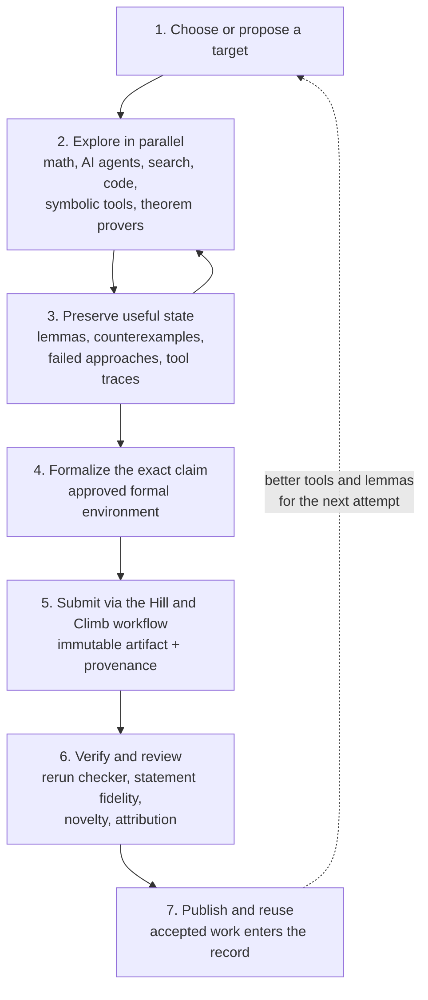
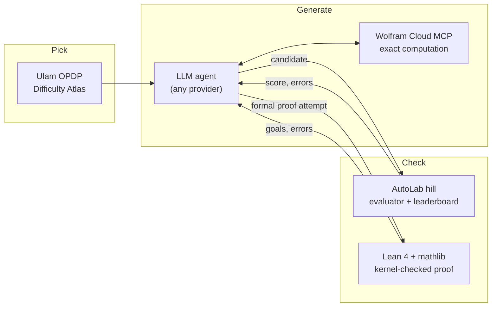
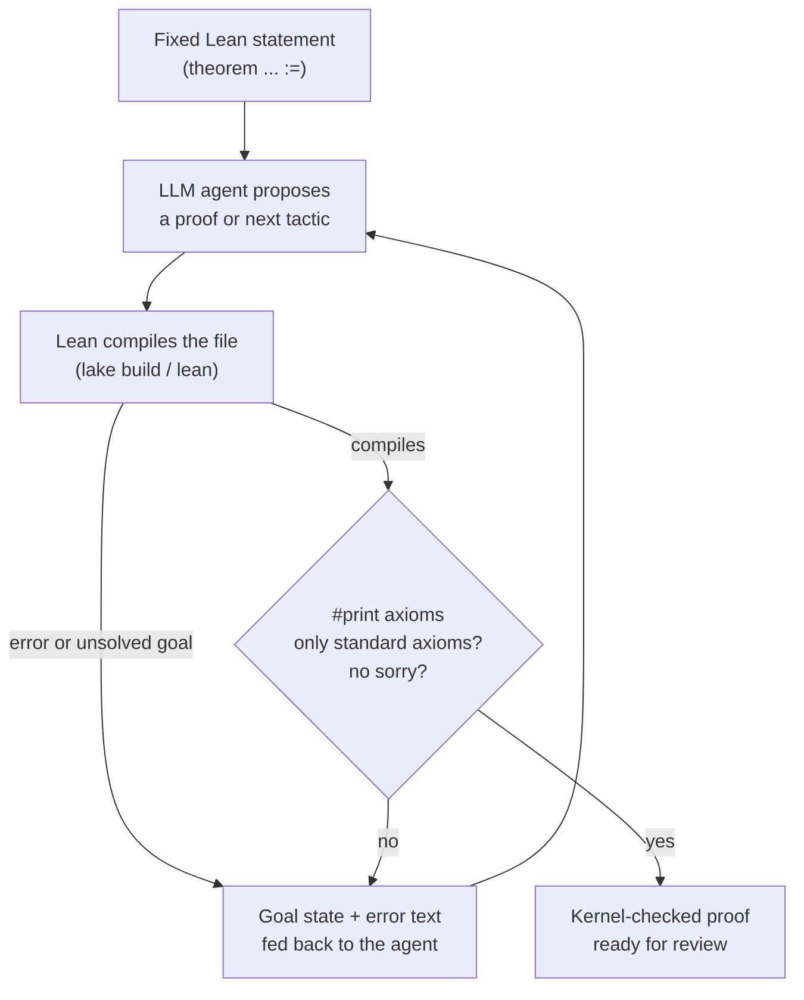
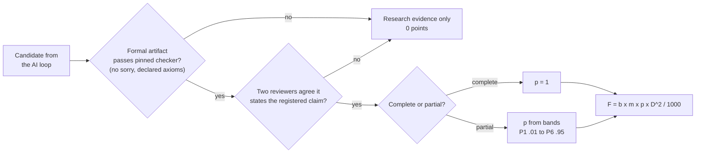

# Sundai Hack 142, explained: AI loops + formal verification on open math problems

_A plain-language field guide to Sundai Hack 142 (Sunday 27 September 2026, Harvard Innovation Labs) and the week-long **OpenMath 2026** competition it kicks off: what the event is, what teams are actually asked to do, the tools, and why it matters._

> **TL;DR**
> 1. Teams point AI "research loops" at hard, open math problems. The AI proposes, a computer checks, and the loop repeats.
> 2. **Only machine-checked results count.** A persuasive answer, a numerical pattern or a confident model earns nothing until it is encoded as a formal artifact (for example a Lean 4 proof) that passes a checker and human review.
> 3. Points scale with the **square** of the problem's difficulty, so a real partial result on a hard problem can outscore a full result on an easy one.

---

## ELI5: the whole event in one paragraph

Mathematics has puzzles that nobody in history has solved. Today teams get a tireless helper (an AI) that can try thousands of ideas an hour, and a very strict referee (a proof checker called Lean, plus automatic scorers on a site called AutoLab) that only accepts answers it can check line by line. Think of the AI as a fast, overconfident student and the checker as a teacher who marks every step. The game is to build the best student-and-teacher loop: guess, check, learn from the mistake, guess again. You score points only for answers the teacher accepts, and harder puzzles are worth a lot more.

---

## Map of this repo

| Folder | What is inside |
|---|---|
| [`README.md`](README.md) | This page: the event through the STAR lens (Situation, Task, Action, Result) with diagrams |
| [`problems/`](problems/) | One explainer per competition "hill" (7 runnable problems): ELI5, the exact task, why it matters, how an AI loop attacks it |
| [`tools/`](tools/) | **Lean with AI agents (start here)**, Lean 4 and mathlib, AutoLab hills and climbs, the Ulam OPDP Difficulty Atlas, Wolfram Cloud MCP, the recursive improvement loop |
| [`docs/competition-rules.md`](docs/competition-rules.md) | The OpenMath handbook on one page: modalities, scoring formula, partial-credit bands, deadlines, what does not count |
| [`takeaways.md`](takeaways.md) | Lessons from the day (v1 written before the 20:00 presentations, updated after) |

---

## The big picture

```mermaid
flowchart LR
    P["Open problem<br/>(Atlas-rated difficulty)"] --> H["AutoLab hill<br/>task + evaluator + metric"]
    H --> L{{"AI research loop<br/>propose, compute, test"}}
    L -->|"candidate"| E["Hill evaluator<br/>exact score"]
    E -->|"feedback"| L
    E -->|"best candidate"| F["Formal artifact<br/>Lean 4 proof or approved certificate"]
    F --> K["Machine check<br/>pinned checker"]
    K --> R["Human review<br/>fidelity, novelty, attribution"]
    R --> S["Points<br/>F = b x m x p x D^2 / 1000"]
```



---

## S: Situation

**The event.** Sundai Club is the MIT and Harvard AI hacker group that builds a new AI project from scratch every Sunday (130+ hacks back to back). Hack 142 ran 10:00 to 22:00 on Sunday 27 September 2026 at Harvard Innovation Labs, Batten Hall, 125 Western Ave, Allston, with guests **Stephen Wolfram** and **Alejandro Zarzuelo Urdiales**. Its theme: *Recursive Self Improvement and Formal Verification in Mathematics*.

**The bigger event it plugs into.** The same day is the kickoff of **OpenMath 2026** (the handbook calls it the *Open Problems Hack at MIT*), organized by RSI House: one week, 27 September to 2 October 2026, hybrid opening at MIT CSAIL at noon Eastern, open worldwide, teams of 1 to 4, any AI system or none. Its tagline is the whole idea: *fast generation + exact verification + public provenance.*

**Why now.** The organizers' invitation points to recent worldwide news of AI advances on the Navier-Stokes Millennium Prize Problem and the Jacobian Conjecture. That is the organizers' framing; this repo has not independently verified those reports. The talk slides ground the case in documented systems instead:

- **FunSearch** paired a language model with program search and an automatic evaluator to find new cap-set constructions (Nature, 2023).
- **AlphaEvolve** (Google DeepMind) reported improved algorithms, including for matrix multiplication.
- Alejandro's own AI-assisted paper reports a 16 x 16 matrix multiplication construction using 2,208 variable multiplications versus a cited previous bound of 2,212 (a commutative straight-line count, not a new tensor-rank bound, as the talk is careful to say).

**The thesis of the opening talk** (Alejandro Zarzuelo Urdiales, *Mathematics beyond the human mind*): mathematics is a cognitive technology that expands what an intelligence can represent and attempt. Human research is bounded by time, attention and memory, and AI can extend search, coding and formal reasoning inside a human research process. "Recursive improvement" (math produces better tools, better tools make more math reachable) is presented explicitly as a **research hypothesis with bottlenecks**: verification, data, compute and problem selection. It is not presented as a law.

**Who made the day possible** (per the Sundai deck): Wolfram Research (Cloud MCP access and free credits), AutoLab (the hill platform), and Vadim Gerasimov, Pascal Chesnais and friends. Three talks set up the day: *Why Maths + AI*, *What is Lean*, and *What is HillsHub by AutoLab*.

```mermaid
flowchart LR
    A["Sun 27 Sep 10:00<br/>Welcome to Sundai"] --> B["10:10<br/>Intro to RSI and formal<br/>verification in math"]
    B --> C["10:45<br/>Team formation"]
    C --> D["12:00<br/>OpenMath opening<br/>MIT CSAIL, hybrid"]
    D --> E["14:00<br/>Lunch + fireside with<br/>Stephen Wolfram and<br/>Alejandro Zarzuelo"]
    E --> E2["19:45<br/>Sundai project<br/>card deadline"]
    E2 --> F["20:00<br/>Sundai demos"]
    F --> G["Mon 28 Sep to Fri 2 Oct<br/>research, submissions,<br/>rolling review"]
    G --> H["Before 00:00 EDT Sat 3 Oct<br/>all score-bearing work<br/>submitted"]
    H --> I["~1 to 2 weeks later<br/>results ceremony<br/>(provisional)"]
```



---

## T: Task

**Pick a precise mathematical target and produce a result a machine can check.**

There are several ways in:

| Route | What you work on | How it scores |
|---|---|---|
| **M1** | The frozen, curated focus set | Original-problem score x 1.1 focus bonus |
| **M2** | New, faithful, reusable **formalizations of known mathematics** | Separate leaderboard, counted by accepted formalization families |
| **M3A** | Other admitted open problems | Original-problem score |
| **M3B** | Substantive new variations of Open Mathematics problems | Own difficulty, x 1/2 |

The most concrete starting point is the organizer's AutoLab list: **7 runnable hills** (6 from the organizer deck plus Erdős Problem #3, added afterward, which carries an external $5,000 Erdős prize administered independently of the competition) and a catalog of **100 research leads**. A *hill* fixes a task, an evaluator and a metric. A *climb* is your team's attempt.

| # | Hill | What you search for | Metric (direction) | Best on leaderboard, 27 Sep |
|---|---|---|---|---|
| 1 | [Kobon triangles](problems/01-kobon-triangles.md) | Line arrangements with many bounded triangular faces | triangles (max), per number of lines n | 93 at n = 18 (several teams tied) |
| 2 | [Busy Beaver 6 certificates](problems/02-busy-beaver-6-certificates.md) | 6-state Turing machines with long, exactly replayable halting runs | steps, ones, tape_span (max) | 249,881 steps |
| 3 | [Collatz modular descent](problems/03-collatz-modular-descent.md) | Exact descent rules on residue classes | coverage_ppm (max), min_descent_ppm (max), rule_count (min) | coverage 1,000,000 ppm with 3 rules |
| 4 | [3 by 3 matrix multiplication](problems/04-matrix-multiplication-tensor-3x3.md) | Exact low-rank decompositions of the 3x3 matrix-multiplication tensor over the rationals | rank (min), support (min) | rank 23, support 139 |
| 5 | [Grothendieck constant witnesses](problems/05-grothendieck-constant-witnesses.md) | Compact exact certificates that improve a lower bound | gap_ppm (max), matrix_area (min), certificate_bits (min) | gap_ppm 1,414,213 |
| 6 | [Clique clusters and K4 Ramsey multiplicity](problems/06-clique-cluster-ramsey-multiplicity.md) | Weighted clique-cluster templates beating a published upper bound | reference_beaten (max), density_ppt (min) | reference beaten |
| 7 | [Erdős Problem #3](problems/07-erdos-3.md) | A machine-checked Lean 4 proof of a fixed statement | proved (max) | no entries yet |

Leaderboard values are copied from AutoLab on 27 September 2026 and will move. A hill score measures the hill's stated task only (see Result).

---

## A: Action

**Build a loop, not a guess.** The OpenMath site describes the intended workflow as a recursive loop designed to compound:



**The stack a team assembles** (each has a page in [`tools/`](tools/)):



### Lean is the gate (and the organizers want it in your loop)

The organizers' ask is explicit: use **Lean** to help solve. Lean is where an AI's guess becomes a checked fact, because the Lean kernel accepts a proof only if every step type-checks. That makes Lean both the referee and the best feedback signal an agent can get: instead of "this sounds right," it returns the exact remaining goal or the exact error.



There are two Lean routes in this hack, and it matters which hill you pick:

| Route | Hills | What Lean does |
|---|---|---|
| **Prove the theorem** | [Erdős Problem #3](problems/07-erdos-3.md) | The hill fixes a Lean 4 statement (toolchain v4.33.1, Mathlib, built on a formal-conjectures project). You submit only the proof after `:=`. The evaluator appends `#print axioms hill` and accepts the proof only if it compiles, contains no `sorry`, and uses no axioms beyond `propext`, `Classical.choice` and `Quot.sound`. |
| **Certify a witness** | The six construction hills (Kobon, Busy Beaver 6, Collatz, 3x3 matrix multiplication, Grothendieck, K4 Ramsey multiplicity) | A Python evaluator scores your witness. As the Ramsey hill's README puts it, passing is *not* a claim of Lean or Coq verification. To turn a good witness into competition credit, a team states a Lean theorem about that exact object (for example, that a specific decomposition satisfies all the checked identities) and gets it through the approved formal check. |

A third route needs no open problem at all: **formalize known mathematics** that Mathlib is missing (the M2 leaderboard). The practical setup, the agent loop, and the traps (`sorry`, silently changed statements, extra axioms) are in [`tools/lean-with-ai-agents.md`](tools/lean-with-ai-agents.md) and [`tools/lean-4-and-mathlib.md`](tools/lean-4-and-mathlib.md).

**The operating rules that shape the work:**

- **Generation and checking are separate jobs.** Lean's kernel checks a proof term regardless of who or what proposed it; "a confident model response has no special authority here" (Lean talk).
- **Scope honesty.** A construction for one finite case establishes that case. Forty successful tests of n² + n + 41 do not prove it is always prime (it fails at n = 40). A hill score is not a general theorem.
- **Two classic traps in Lean:** proving a subtly different statement (changing > to ≥), and leaving a `sorry` placeholder, which Lean accepts with only a warning.
- **Disclosure and authorship.** Any AI or tool is allowed; material use must be disclosed. Human contributors keep full authorship; AI systems and providers acquire none.

---

## R: Result

**So, are we "using agents to solve math problems"?** Yes, with one precise correction: **agents plus Lean**. Agents are the engine, Lean is the gate, and the unit of success is a **machine-checked, human-reviewed claim with an exact scope**. An agent that finds a great candidate has produced research evidence, not a result, until Lean checks it.

**What "done" looks like at 20:00 today (Sundai).** Sundai's own principles are *Build, Ship, Shortcuts*: a working demo on the public internet. The house rules from the Sundai deck:

- Add your project card by **19:45**. Demos start at **20:00**; attendees vote, and more votes means more time to present. **No slides allowed**: show the thing.
- **Team projects are open source** (you can fork and close it later). Solo hackers may keep code closed but still demo.
- The theme is a suggestion, not a requirement.

For this hack, a strong demo is a team harness that runs a climb on one hill and visibly shows the propose, evaluate, refine loop improving a score (or producing a checked Lean lemma), with the repo public.

**What "done" looks like by Friday (OpenMath).** Before 00:00 EDT on Saturday 3 October 2026, a formal artifact that passes the pinned checker plus two qualified human reviews, submitted through AutoLab with its Hill version, Climb link, commit, evaluator report and disclosures. Scoring per accepted problem family:

```text
F = b x m x p x D^2 / 1000
  D = published OPDP difficulty on a 0-1000 scale (from the organizers)
  p = reviewed progress, 0 to 1 (partial-credit bands P1..P6, or 1 for a full result)
  m = 1 for M1/M3A, 1/2 for M3B
  b = 1.1 for the focus set, 1 otherwise (plus any jury bonus)
```

| Worked examples from the handbook | Points |
|---|---|
| Complete result, D = 400 | 160 |
| Complete result, D = 800 | 640 |
| Accepted partial (p = 0.5), D = 800 | 320 |
| Same, as an M3B variation | 160 |

Because only D is squared, a half-solved hard problem (320) beats a fully solved easy one (160). Two rankings are published per entrant class: **total accepted output** and **biggest single accomplishment**.



---

## What our team built on the day

We ran the full loop, AI agents plus AutoLab plus Lean, on a single MacBook Pro (M4 Max). Everything below was checked by a machine, not argued.

| Hill | What we did | Status |
|---|---|---|
| [Grothendieck constant witnesses](problems/05-grothendieck-constant-witnesses.md) | Exhaustive search over rational points on the unit circle (hypotenuse up to 3000) and on the sphere (denominator up to 300) for the cheapest exact CHSH certificate. It found an 80-bit witness and none cheaper within either search range. Annealing over sign matrices up to 8x8 found nothing above sqrt(2). | Scored on AutoLab: gap_ppm 1,414,213, 80 bits, tied with the top score. Proved in core Lean 4 in [`lean/Grothendieck.lean`](lean/Grothendieck.lean), axioms: `propext` only. |
| [3x3 matrix multiplication](problems/04-matrix-multiplication-tensor-3x3.md) | Ternary flip-graph search (Kauers and Moosbauer style flips, reductions and plus-transitions, plus a triangle reduction that removes a term when three terms share a factor and their other factors are linearly dependent), first in Python, then in C at about a million flips per second per core. Seeds came from Laderman, from Perminov's published scheme with 88 naive additions (support 143), and from Heule, Kauers and Seidl repository schemes (best support 142). The winning lineage started from their scheme i6w187c48ae, support 145. | Scored on AutoLab: **rank 23, support 139, tied with the top score** (Laderman's classic scheme has support 153). The scheme is [`lean/matmul-rank23-support139.json`](lean/matmul-rank23-support139.json), with all 729 Brent identities proved in core Lean in [`lean/Scheme139.lean`](lean/Scheme139.lean) by `decide +kernel`. Axioms: `propext` only. |
| [K4 Ramsey multiplicity](problems/06-clique-cluster-ramsey-multiplicity.md) | Exact integer bitset annealing over edge flips from the Parczyk, Pokutta, Spiegel and Szabo 768-vertex graph. The objective reduces to 24(K4 red + K4 blue) + 36 blue triangles + 14 blue edges + m, so every flip has an exact delta computable in microseconds. After that came gradient descent on the 768 block weights, a freedom the hill's weighted blow-ups allow. | Improved the published seed from P = 0.0301448570 to P ≈ 0.0301424535 (weighted; exact rational check with the hill evaluator in progress). That is still above McKay's reference B* = 0.0301422734, which four teams have beaten. Work in progress for the OpenMath week. |

The Lean certificates use `decide` / `decide +kernel` only (no `sorry`, no native evaluation), so the kernel checks every step.

## Why this matters

1. **It is a live experiment on AI-driven research.** The organizers keep three ledgers apart: the entrant competition, the "Collective Mathematical Frontier" (each result counted once), and a model-and-harness evaluation. The output is evidence about which research processes work, not a promised number of breakthroughs.
2. **Math is the cleanest environment for AI reasoning.** Statements are exact and feedback is sharp, so an improvement can be checked instead of argued. The open question the talk raises is whether gains *transfer* to unfamiliar problems.
3. **The pattern generalizes.** Cheap generation plus a trustworthy verifier plus preserved state is the same architecture behind coding agents with test suites and evaluation-driven AI products. Math just makes the verifier unusually strict.
4. **Formalization compounds.** A small checked lemma can become a dependency of a much larger proof. Missing mathlib lemmas are useful contributions in their own right (the M2 track).

---

## Glossary

| Term | Meaning |
|---|---|
| **Hill** | An AutoLab task: fixed version, evaluator code and metric |
| **Climb** | A team's recorded sequence of attempts on a hill |
| **Lean 4** | A programming language and proof assistant; its small **kernel** checks proofs |
| **mathlib** | Lean's community library of formalized mathematics |
| **`sorry`** | Lean placeholder for an unfinished proof; allowed with a warning, never acceptable in a submission |
| **Witness / certificate** | A concrete object (matrix, machine, decomposition) whose property can be checked exactly |
| **OPDP** | Open Problem Difficulty Profile: the Atlas's multi-dimensional difficulty rating |
| **D** | Competition difficulty on a 0 to 1000 scale, supplied by the organizers |
| **p** | Reviewed progress coefficient for a partial result (bands P1 to P6) |
| **M1 / M2 / M3A / M3B** | Focus set / formalization of known math / other open problems / variations |
| **MCP** | Model Context Protocol: how an LLM client calls external tools such as Wolfram |

---

## Sources and credits

- Sundai Hack 142 event page: https://www.sundai.club/events/boston/recursive-learning-hack-with-harvard-innovation-labs and the hack deck at https://www.sundai.club/guide (Sundai sign-in required)
- OpenMath 2026 (RSI House): https://rsihouse.ai/openmath and the [Competition and Judging Handbook](https://rsihouse.ai/openmath/handbook.pdf)
- Organizer problem list on AutoLab: https://app.autolab.ai/lists/alejandrozu/openmath
- Ulam OPDP Difficulty Atlas: https://github.com/alejandrozu/ulam-opdp-difficulty-atlas and https://www.unsolvedmath.com/
- Talks by Alejandro Zarzuelo Urdiales: *Mathematics beyond the human mind* and *Programming in Lean* (OpenMath 2026). Slide content is paraphrased here, not reproduced.
- Lean: https://lean-lang.org/learn/ and https://live.lean-lang.org/
- Wolfram Cloud MCP: https://www.wolfram.com/artificial-intelligence/mcp/cloud/
- FunSearch: https://www.nature.com/articles/s41586-023-06924-6 ; AlphaEvolve: https://deepmind.google/blog/alphaevolve-a-gemini-powered-coding-agent-for-designing-advanced-algorithms/

Problem statements and difficulty data belong to their original authors and sources (the Atlas dataset is CC BY 4.0). This is an independent explainer, not an official OpenMath, Sundai or Wolfram document; the handbook is authoritative wherever this summary differs.

**AI use disclosure:** researched and drafted with Claude (Anthropic) using a multi-agent draft-and-verify workflow; every problem page was checked by an independent AI fact-checker against the source files, then reviewed by the author.
