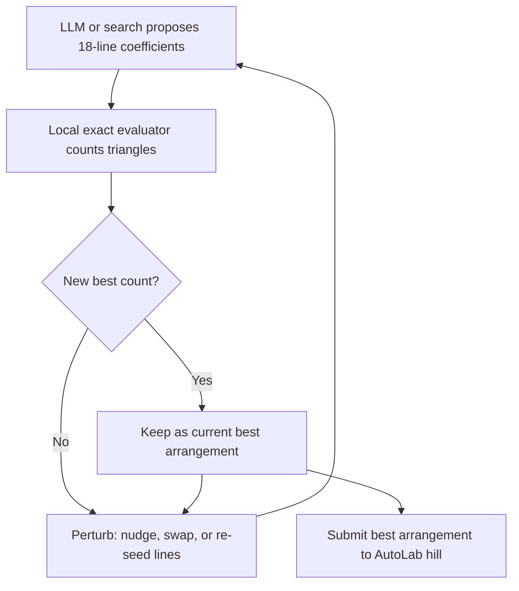

# Kobon Triangles

_Arrange a fixed number of straight lines on a plane so that as many of the triangular gaps they create are left uncut by any other line._

## ELI5

Imagine dropping eighteen perfectly straight strands of uncooked spaghetti onto a table so they cross every which way. Wherever three strands cross in just the right pattern, they fence in a tiny triangular patch of empty table, and that patch only counts if no fourth strand slices through it. Your job is to arrange the spaghetti so that as many of these fenced triangles appear as possible. An early proof by Saburo Tamura showed that eighteen strands can never fence in more than 96 such triangles. Two respected reference tables report tighter ceilings than Tamura's, but they do not agree with each other: MathWorld lists 95 as the tightened Clement and Bader bound for eighteen lines, while Wikipedia's own table of known values lists a different, tighter figure of 94 for the same eighteen lines. This page does not pick a winner between those two sources; it just reports both. What both sources agree on is the best arrangement anyone has actually built so far: 93 triangles. So the honest picture is a proven ceiling of somewhere around 94 to 95 depending on which published table you trust, an actual best build of 93, and nobody currently knows whether that gap can be closed, or whether 93 is secretly the true best that can ever be built. That gap between what is proven possible and what has actually been constructed is exactly what this competition problem asks a team to shrink.

## The exact task on AutoLab

A team submits a solution.json file with exactly one field, lines: a list of exactly n triples [a, b, c] encoding the line a*x + b*y + c = 0. Every coefficient must be a JSON integer with absolute value at most 10^30, at least one of a or b must be nonzero, and proportional triples (the same line written two ways) are rejected as duplicates. The file must be under 65,536 bytes, UTF-8, not a symlink, and contain no floats, booleans, NaN, infinity, duplicate keys, or extra fields. The comparison parameter is n, the required number of distinct lines, fixed at n = 18 by default (the hill allows n from 3 through 100, but different n values are never compared against each other).

The evaluator, kobon-triangles.eval.py, never executes anything a team submits. It computes every pairwise line intersection using exact integer and Fraction arithmetic, deduplicates and ranks the intersection points along each line, and counts a triple of lines as a triangle only when their three pairwise intersection points are mutually adjacent (rank distance 1) on all three lines at once, which is exactly the geometric definition of a bounded triangular face uncrossed by any other line. The single scored metric is triangles, direction maximize. Validation and final scoring apply the identical rule to the identical submitted arrangement; final=True only changes a report label. The watchdog is 120 seconds for the evaluator itself; there is no limit on how long or by what method a team spends producing the arrangement before submitting it. Hill version 0.1.0, checked locally with hills package 0.11.0.

## Why this problem matters

The Kobon triangle problem, posed by the Japanese mathematician Kobon Fujimura, is an unsolved problem in combinatorial geometry asking how many non-overlapping triangles k straight lines can create. Saburo Tamura proved a first upper bound of floor(k(k-2)/3), which gives 96 for k = 18. G. Clement and J. Bader later tightened that bound for k congruent to 0 or 2 modulo 6, which is exactly the case for k = 18; MathWorld's table lists their tightened figure as 95 for k = 18 (mathworld.wolfram.com/KobonTriangle.html). Wikipedia's own table of known values for the Kobon triangle problem lists a different, tighter figure for k = 18, labeled as an improvement on Tamura's bound of 94 (en.wikipedia.org/wiki/Kobon_triangle_problem). These two published sources do not agree with each other on the single tightest proven ceiling for eighteen lines, and this page does not resolve that disagreement; both agree, along with the hill's own leaderboard, that the best arrangement actually built for eighteen lines has 93 triangles. The exact maximum is known for only a limited set of small k, and a 2025 paper introduced a compact table encoding of pseudoline arrangements, transformed the search into a SAT problem, and used a heuristic straightening method to recover new optimal straight-line arrangements for 23 and 27 lines while proving no optimal solution exists for 11 lines (arxiv.org/abs/2507.07951). For AI, the problem is a clean search-and-verify sandbox: a huge, structured combinatorial search space paired with a cheap, exact checker, which is exactly the shape of task where propose-and-verify loops tend to outperform unaided human intuition, while the checker itself removes any risk of a wrong answer being accepted.

## Where the frontier is

The hill's leaderboard snapshot, dated 2026-09-27 at about 11:40 EDT, shows 7 entries at n = 18, with the top 3 tied at triangles = 93 (source bundle). That matches the best published construction for k = 18 lines described by both MathWorld and Wikipedia: 93. The two published sources do not agree on the single tightest proven upper bound for k = 18: MathWorld lists 95 as the Clement and Bader refinement of Tamura's bound, while Wikipedia's table lists a tighter 94; this page reports both rather than choosing between them. No source fetched for this page reports a proof that 93, 94, or 95 is the true maximum for 18 lines; the gap between the 93 already built and the proven ceiling of 94 or 95 is currently open.

## What a hill score proves, and what it does not

A submitted arrangement with T verified triangles is a finite construction: exact, exhibited proof that at least T triangles are achievable with 18 lines. It is not a proof of the finite optimum for 18 lines, which would require also proving no arrangement of 18 lines can do better, and it is not a general theorem about arbitrary line counts. The OpenMath speaker talk that uses this exact hill as its worked example draws the same three-way distinction: a construction establishes a lower bound, a matching upper bound would resolve the finite optimum, and a result for every number of lines needs a general argument. Under the handbook, a bare AutoLab pass is necessary but not itself a proof (section 7.2); a construction beating 93 would most plausibly be scored, once formalized and reviewed, as a computation-type partial advance in bands P1 through P3, since the handbook states that exhaustive finite results require a formal certificate or verified procedure and may justify credit at that scope (section 5), never as a solved open problem, because the general maximum for every k remains unresolved.

## How an AI loop attacks it

A workable loop treats the evaluator as ground truth and never trusts an LLM's self-reported triangle count. An LLM or a symbolic search tool proposes a set of 18 integer line coefficients, seeded from known productive families such as pencils through a small number of points, near-parallel bundles, or pseudoline tables recovered into straight lines using the 2025 paper's method. A local copy of the exact evaluator counts triangles and returns both the count and the supporting line triples. That structured feedback, which triples already form triangles and which near-misses are one line away, is what an LLM or a local search heuristic uses to propose a small perturbation: nudge one line's coefficients, swap a nearly parallel pair, or re-run a SAT solver over a compact table encoding of the arrangement. Keep the best-scoring valid arrangement found so far and repeat. Lean or Wolfram do not check the geometry, since the evaluator already does that exactly; their role, if a team wants to go beyond the hill, is proving a matching upper bound or a general formula in Lean, a much harder and separate mathematical project from winning the hill.

## The Lean route

The hill's own evaluator, kobon-triangles.eval.py, is already an exact check: it uses Python's arbitrary-precision integers and the Fraction type to compute every pairwise intersection and to rank points along each line, so a reported score of T triangles is a deterministic, exact computation, not an approximation. That is not the same thing as a Lean proof. A Lean proof is a formal proof term checked by Lean's kernel against a stated theorem; the hill's evaluator is a trusted Python script whose correctness a team simply believes, rather than something a kernel has certified.

The Lean theorem a team would actually want to state about its own submitted arrangement is narrow and concrete: given these exact 18 lines (the same integer triples a, b, c submitted to AutoLab), the resulting arrangement has at least T bounded triangular faces, for the specific T the evaluator reported. That is a finite, decidable statement about finitely many rational coordinates, not a claim about every possible arrangement of 18 lines.

Formalizing that statement directly in core Lean, meaning Lean without Mathlib, is harder than it looks, because the hill's own Python computation leans on machinery core Lean does not supply for free: arbitrary-size deduplicated intersection sets, sorting points along a line by a Fraction-valued rank, and comparing that ranking across three lines at once for every triple. Reproducing this in Lean would most plausibly need pieces of Mathlib: its rational-number library, its finite-set (Finset) machinery, and an ordering or sorting development over Finset, plus a formal definition of "bounded triangular face" that matches the evaluator's rank-adjacency rule exactly. Getting that Lean definition to faithfully mirror what the Python evaluator actually checks, rather than a subtly different geometric notion, is itself the hard part of the exercise; a mismatch there would prove a theorem about the wrong statement even if the Lean proof itself is flawless.

Once the statement and definitions are in place, discharging the resulting finite arithmetic obligation is where the choice between decide and native evaluation (decide +native, formerly written native_decide) matters. Plain decide, or decide +kernel, asks Lean's own kernel to evaluate the decidability instance, which keeps the trusted base small but can be far too slow to finish for large exact-rational computations. Native evaluation instead compiles the check to native code and admits the result via an axiom, Lean.trustCompiler in older Lean versions or a dedicated per-computation axiom since Lean 4.29.0, which is much faster but means the proof now depends on the correctness of the Lean compiler rather than only the kernel, and external checkers cannot re-verify a native-evaluated proof the way they can a kernel-checked one (lean-lang.org/doc/reference/latest/ValidatingProofs/). A team choosing native evaluation for speed should disclose that choice plainly, since it changes what "checked" means for the result.

Under the handbook, an exhaustive finite result like a certified Kobon construction needs a formal certificate or verified procedure and may earn credit at the appropriate scope, most plausibly bands P1 through P3 (handbook section 5); the handbook does not name a specific band for this exact hill, and judges decide the appropriate scope on review.

## A realistic plan for a Sundai team

For the 20:00 demo on kickoff day (the Sundai event schedule lists demos at 20:00, following a 19:45 Sundai.Club project card deadline; Sundai Hack 142 event page, https://www.sundai.club/events/boston/recursive-learning-hack-with-harvard-innovation-labs, Sundai Hack 142 deck, https://www.sundai.club/guide), a team can realistically get a valid submission running end to end: load the baseline (16 triangles from the 18 lines 2*i*x - y - i*i = 0, i = 0 through 17), run a local copy of the evaluator to confirm the harness works, then spend the afternoon on a search loop, whether random perturbation, simulated annealing, or LLM-guided rewrites of coefficients, to beat 16 and show a live, verified improvement. That is an honest, demoable win even if it lands well under 93. Reaching or beating the current best of 93 by the submissions-close deadline, before 00:00 EDT Saturday, 3 October 2026 (handbook section 2.1), is a stretch goal that would most plausibly need a strong SAT-based search following the 2025 paper's method, or a good deal of luck with heuristic search; it would score as M1 or M3A computation-type partial credit at best, not as a solved open problem, since the general maximum is still unknown. See ../docs/competition-rules.md for the full scoring mechanics, and ../tools/lean-4-and-mathlib.md if a team wants to attempt a formal upper-bound argument instead of a construction.

## Atlas difficulty profile

The bundle's closest Ulam OPDP Atlas v1.6 record, found by title search, is AMR-071-0050, 'The Kobon triangle problem on triangles in line arrangements,' which may be the parent problem rather than the exact n = 18 hill task. Copying its numbers verbatim: tier T3 Serious Project, intrinsic_difficulty_0to10 = 5.4 (range 3.6 to 7.2), ai_difficulty_0to10 = 4.9, ai_fit AI-neutral/mixed, tractability T5, progress_probability 25-40%, verification_if_true 5.9, formalization 5.8, tool_leverage 4.5, recommended_route 'Status and literature audit,' catalog_status open, review flags status_NEEDS_REVIEW and legacy_default_L3. These are 0-10 Atlas scores, not the competition's 0-1000 D(P); the bundle explicitly warns not to convert or estimate that scale, so no competition difficulty number is given here.

## Sources

- AutoLab hill https://app.autolab.ai/hills/alejandrozu/kobon-triangles (README, hill.yaml and leaderboard snapshot of 27 Sep 2026)
- eval.py of AutoLab hill https://app.autolab.ai/hills/alejandrozu/kobon-triangles
- OpenMath Competition and Judging Handbook, https://rsihouse.ai/openmath/handbook.pdf (sections 2.1, 4, 5, 7.2)
- talk "Programming in Lean" (Alejandro Zarzuelo Urdiales, OpenMath 2026) (slide 10)
- Sundai Hack 142 event page, https://www.sundai.club/events/boston/recursive-learning-hack-with-harvard-innovation-labs
- Sundai Hack 142 deck, https://www.sundai.club/guide
- https://en.wikipedia.org/wiki/Kobon_triangle_problem
- https://mathworld.wolfram.com/KobonTriangle.html
- https://arxiv.org/abs/2507.07951
- https://lean-lang.org/doc/reference/latest/ValidatingProofs/
</content>
