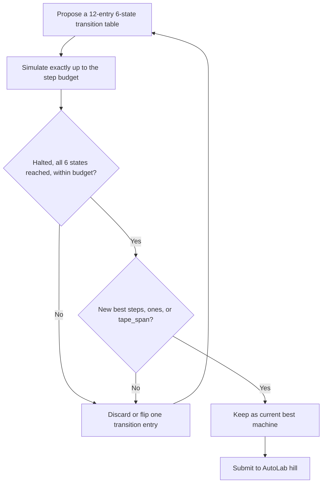

# Busy Beaver 6 Certificates

_Find a six-state Turing machine that runs for as long as possible before halting, as an exact and checkable proof of how large the Busy Beaver function must be._

## ELI5

Imagine a tiny robot living on an endless strip of blank paper. It has six different moods, call them A through F, plus a special mood called done. In each mood, it looks at the square underneath it, marked or blank, decides whether to mark or erase that square, steps left or right, and switches to a new mood, all following a fixed rulebook of exactly twelve rules. The Busy Beaver question asks, using a rulebook with only six moods, what is the longest a robot can run before it settles into done? This hill does not ask a team to find the single longest-running robot possible, since nobody knows how to find that; it asks a team to hand over one specific rulebook, prove the robot it describes actually reaches done after some exact number of steps, and show the robot used all six of its moods along the way. Every such rulebook that halts is a small, permanent brick of certainty about how large the true answer must be.

## The exact task on AutoLab

A team submits one solution.json with a single field, transitions, a JSON object with exactly the six keys A through F (the halting state H is never a key). Each state maps to exactly two entries, keyed '0' and '1', each of the form [write, move, next_state], where write is the JSON integer 0 or 1, move is the string 'L' or 'R', and next_state is one of A through F or H. The machine starts in state A, head position 0, on a tape that is all zeros in both directions. The evaluator, busy-beaver-6-certificates.eval.py, simulates the machine exactly and deterministically, with no submitted code ever executed. It accepts a submission only if the machine halts, reaches H, before a private step-limit budget (the evaluator itself enforces 10 <= step_limit <= 2,000,000, read from a private file that differs between validation and test) and only if the run visited all six non-halting states; a machine that fails to halt in budget, or halts without touching all six states, is rejected outright rather than partially scored. Three metrics are computed and ranked lexicographically: steps (exact transition count before halting, maximize), ones (count of 1 symbols on the tape at halting, maximize), and tape_span (cells from leftmost to rightmost visited, maximize). Validation and test use separate private budgets, and the final result is the test-split result. Hill version 0.1.0.

## Why this problem matters

The Busy Beaver function, first posed by Tibor Rado, asks for the maximum number of steps a halting Turing machine with a given number of states can take; it grows faster than any computable function, and exact values are known only for very small state counts. The current published lower-bound record for the six-state, two-symbol case, the same machine model this hill uses, was set by a contributor known as mxdys in June 2025, with the machine 1RB1RA_1RC1RZ_1LD0RF_1RA0LE_0LD1RC_1RA0RE, giving the bound 'S(6)>Σ(6)>10↑↑10↑↑10↑↑8' in tower notation, per BusyBeaverWiki (wiki.bbchallenge.org/wiki/BB(6)), a number too large to write in ordinary decimal form. The same page notes that a machine nicknamed Antihydra, discovered in June 2024, showed that fully resolving BB(6) requires understanding a Collatz-like dynamical question, and that as of mid-September 2026 the page's holdouts list has 855 machines when counted up to equivalence and 1,802 machines when equivalence is not considered; a separate informal holdout count given on the same page is 1,101, without tying that figure to the equivalence-counting distinction. For AI, Busy Beaver hunting is a search problem over a small, exactly enumerable rule space where the payoff, steps before halting, can only be known by simulation or, for the very largest machines, by a separate mathematical argument about their behavior; that combination of astronomically large consequences and a perfectly mechanical checker is exactly the kind of frontier where automated search paired with exact verification is decisive.

## Where the frontier is

The hill's leaderboard snapshot, dated 2026-09-27 at about 11:40 EDT, lists 4 entries: the best is steps=249,881, ones=554, tape_span=735, dated 2026-09-21 in the bundle; the next two are steps=246,872, ones=480, tape_span=629, and steps=177,725, ones=181, tape_span=539 (source bundle). These hill numbers sit far below the published mathematical frontier for six-state Busy Beaver machines, 10↑↑10↑↑10↑↑8 steps per BusyBeaverWiki, because busy-beaver-6-certificates.eval.py itself enforces that the private step-limit budget can be at most 2,000,000 (10 <= step_limit <= 2,000,000): no submission whose machine needs more than 2,000,000 actual simulated steps to halt can ever be accepted on this hill, however it is discovered, so the hill can never score anywhere near the astronomically long known BB(6) champions such as mxdys's machine already published on BusyBeaverWiki. The hill and the published research frontier concern the same mathematical object but occupy very different achievable ranges.

## What a hill score proves, and what it does not

An accepted submission is an exact, replayable finite lower-bound witness. The bundle states plainly that every accepted submission is therefore a rigorous finite lower-bound witness for S(6), and that a high score is a candidate lower bound, not a proof that no longer halting machine exists. It is a finite construction, not a finite optimum, since nobody has proven any six-state machine is the longest-running one, and certainly not a general theorem, since BB(n) for arbitrary n is uncomputable in general. Under the handbook, a bare AutoLab pass is necessary but not itself a proof (section 7.2); an accepted, formalized halting certificate on this hill would most plausibly earn computation-type partial credit in bands P1 through P3, since exhaustive finite results require a formal certificate or verified procedure and may justify credit at that scope (section 5), while meaningfully raising the actual published BB(6) lower bound, already past 10↑↑10↑↑10↑↑8, is entirely outside what a 2,000,000-step-budget hill can ever demonstrate.

## How an AI loop attacks it

A workable loop treats the local simulator as ground truth and never trusts a model's own arithmetic. An LLM or a systematic enumerator proposes a full twelve-entry transition table, seeded from known productive families such as machines that reach all six states early or near-misses of the current best, respecting the requirement that every state actually gets visited. A local simulator matching the evaluator exactly runs the machine up to the same budget and reports whether it halted, in how many steps, and which states it touched; a machine that loops without halting, or halts without touching all six states, is immediately rejected and that shape of rule deprioritized. That step-count-and-states-reached feedback is what an LLM or a local hill-climbing search uses to decide which single transition entry to flip next, changing one write, move, or next-state value, to try to delay halting further while still reaching all six states. Keep the best halting, budget-respecting machine found so far. Lean has no natural role here, since the evaluator already is the exact checker; the closer analogue to a Lean-style rigor step is an independent, from-scratch re-simulation, ideally in a second language, to confirm the exact step count before submission.

## The Lean route

The hill's evaluator, busy-beaver-6-certificates.eval.py, is a Python simulator: it starts the submitted six-state machine on an all-zero bi-infinite tape and steps it forward exactly, stopping either when the machine halts or when it exhausts a private step budget that eval.py itself constrains to between 10 and 2,000,000 steps. A passing submission means the simulator observed a halt within that budget and confirmed all six non-halting states were visited; that is an exact result, but it is a trusted Python computation, not a Lean-checked proof.

The Lean theorem a team would actually want to state about its own accepted submission is narrow and fully finite: this specific transition table, started in state A on an all-zero tape, halts after exactly N steps, for the N the evaluator reported. Because N is a fixed, modest natural number for any machine this hill can accept, at most 2,000,000 by the evaluator's own step-limit ceiling, this is exactly the kind of statement a kernel-level computation can in principle check directly. Lean can unfold the machine's step function N times and confirm it reaches the halting state, without needing Mathlib beyond a plain definition of the transition function and repeated function application, since the whole claim concerns one concrete, bounded computation rather than an infinite family.

That said, N steps of unfolding is only cheap "in principle." Whether plain decide, or decide +kernel, finishes in reasonable compile time depends heavily on how efficiently the machine's step function is encoded; for machines anywhere near the current hill leaderboard's steps=249,881, a naive kernel unfolding could be slow enough that a team reaches for native evaluation (decide +native, formerly written native_decide) instead, which trades kernel-only trust for trust in the Lean compiler in exchange for speed, and which external checkers cannot re-verify the way they can a kernel-checked proof (lean-lang.org/doc/reference/latest/ValidatingProofs/). A team should disclose which mode it used and let judges weigh that trust boundary.

This kind of finite halting certificate has a real precedent at a much larger scale. In 2024, the Busy Beaver Challenge's contributor mxdys published Coq-BB5, a Rocq (formerly Coq)-verified proof that BB(5) = 47,176,870, meaning every five-state machine that runs longer than that number of steps is proved to run forever, per BusyBeaverWiki (wiki.bbchallenge.org/wiki/BB(5)). That project formalized a whole enumeration-and-deciders argument covering all 5-state machines, not just one machine's halting trace, and is a far larger undertaking than certifying a single accepted hill submission; it is offered here only as evidence that Turing-machine halting claims at this scale are formally checkable in principle, not as a claim about what a one-week team could replicate.

Under the handbook, a formalized halting certificate for one accepted six-state machine would most plausibly earn computation-type partial credit in bands P1 through P3, since exhaustive finite results require a formal certificate or verified procedure and may justify credit at that scope (handbook section 5); the handbook does not name a specific band for this hill, and judges decide the appropriate scope on review.

## A realistic plan for a Sundai team

For the 20:00 demo (the Sundai event schedule lists demos at 20:00, following a 19:45 Sundai.Club project card deadline; Sundai Hack 142 event page, https://www.sundai.club/events/boston/recursive-learning-hack-with-harvard-innovation-labs, Sundai Hack 142 deck, https://www.sundai.club/guide), a team can get a correct, halting six-state machine end to end quickly: start from the sample in the bundle, which halts after six steps by construction, confirm it passes the local evaluator, then run a short systematic or LLM-guided search over nearby machines to demo a live, verified improvement over that trivial baseline. Beating the current hill leaderboard's steps=249,881 by the deadline, before 00:00 EDT Saturday, 3 October 2026 (handbook section 2.1), is plausible with an efficient brute-force or heuristic search, since 249,881 steps is well inside what a computer can simulate directly. Meaningfully advancing the actual published S(6) research frontier, already beyond 10↑↑10↑↑10↑↑8, is not realistic in this format, because the evaluator's own 2,000,000-step budget cannot simulate machines anywhere near that scale; a team should treat this hill as a certified-lower-bound sandbox rather than a route to a new world record. See ../docs/competition-rules.md for scoring mechanics, and ../problems/01-kobon-triangles.md for a hill whose current frontier is closer to what a one-week search can realistically move.

## Atlas difficulty profile

The bundle states plainly: no Atlas v1.6 record was found by title search for this problem, and it directs not to invent a difficulty score. No Ulam OPDP Atlas record is used for this page, and no competition D(P) or 0-10 Atlas number is estimated here.

## Sources

- AutoLab hill https://app.autolab.ai/hills/alejandrozu/busy-beaver-6-certificates (README, hill.yaml and leaderboard snapshot of 27 Sep 2026)
- eval.py of AutoLab hill https://app.autolab.ai/hills/alejandrozu/busy-beaver-6-certificates
- OpenMath Competition and Judging Handbook, https://rsihouse.ai/openmath/handbook.pdf (sections 2.1, 5, 7.2)
- talk "Programming in Lean" (Alejandro Zarzuelo Urdiales, OpenMath 2026) (slide 10)
- Sundai Hack 142 event page, https://www.sundai.club/events/boston/recursive-learning-hack-with-harvard-innovation-labs
- Sundai Hack 142 deck, https://www.sundai.club/guide
- https://wiki.bbchallenge.org/wiki/BB(6)
- https://wiki.bbchallenge.org/wiki/BB(5)
- https://lean-lang.org/doc/reference/latest/ValidatingProofs/
</content>
