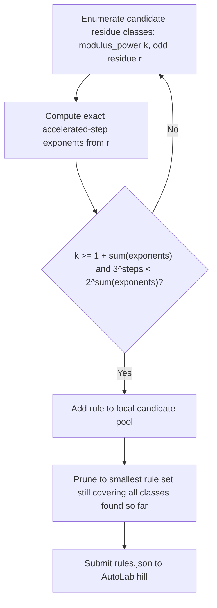

# Collatz Modular Descent

_Prove, for a whole family of numbers sharing a repeating remainder pattern, that a sped-up version of the Collatz process always makes them smaller._

## ELI5

The famous Collatz rule says: if a number is even, cut it in half; if it is odd, triple it and add one. Nobody knows whether repeating that rule on any starting number always eventually reaches 1. This hill does not ask a team to answer that giant question. Instead, it asks a team to find a whole family of odd numbers, all sharing the same remainder when divided by some power of two, like every number that leaves remainder 9 when divided by 16, and prove that a sped-up version of the Collatz rule always shrinks every single number in that family, using only a short, exact list of halving amounts along the way. It is a bit like proving a rule about every house on one specific numbered street at once, using the shared street number, instead of checking each house's address one at a time. The wider the street your rule covers, the more valuable your certificate.

## The exact task on AutoLab

A team submits one solution.json with a single field, rules, a list of at most 512 rule objects. Each rule has modulus_power, an integer k from 2 through 32; residue, an odd integer r with 0 < r < 2^k; and exponents, a nonempty list of 1 to 24 integers, each from 1 through 32, where exponents[i] must equal the exact 2-adic valuation v2(3x+1) at accelerated step i for every x in the residue class n = residue (mod 2^k). The evaluator, collatz-modular-descent.eval.py, requires k >= 1 + sum(exponents) so the valuation pattern is provably stable across the whole class, then checks two things exactly: that 3^(number of steps) < 2^(sum of exponents), meaning the accelerated map is a strict contraction, and that applying that map to the class's least representative actually produces a smaller number than it started with. Three metrics rank lexicographically: coverage_ppm, the fraction of hidden target residue classes covered, in parts per million, maximize; min_descent_ppm, the weakest contraction margin among rules that actually cover a hidden target, in parts per million, maximize; and rule_count, the number of submitted rules, minimize. The hidden targets are private, drawn from odd residue classes at moduli 2^8 through 2^12, and validation and test use different private target sets and weights. Hill version 0.1.0.

## Why this problem matters

The Collatz, or 3n+1, or Syracuse conjecture is one of the best known open problems in number theory. In 2019, Terence Tao proved that almost all Collatz orbits, in the sense of logarithmic density, attain almost bounded values, a major partial result well short of full resolution (terrytao.wordpress.com, posted 2019-09-10). Tao's proof works with an accelerated Syracuse map, Syr(N) = (3N+1)/2^a where 2^a is the largest power of 2 dividing 3N+1, the same accelerated step this hill's rules certify, and it treats the exponent a as behaving like a random variable with a geometric distribution of mean 2 across residue classes, the same 2-adic structure this hill makes exact and checkable for specific finite residue classes rather than statistically for almost all integers (terrytao.wordpress.com). For AI, this is a search-and-certify problem over a huge but exactly enumerable space of small residue classes: a search procedure proposes a class and step pattern, and checking that it stabilizes and contracts is pure arithmetic requiring no proof search or human judgment, exactly the kind of task where automated exploration paired with an exact checker can plausibly out-produce manual case analysis.

## Where the frontier is

The hill's leaderboard snapshot, dated 2026-09-27 at about 11:40 EDT, lists 5 entries, with the top 3 identical at coverage_ppm=1,000,000, min_descent_ppm=525,390, rule_count=3 (source bundle), meaning the current best known submissions already cover 100 percent of the private target set the hill has been tested against so far, using only 3 rules. No source fetched for this page states what the actual hidden target residue classes are, since they are private by design.

## What a hill score proves, and what it does not

A certified rule is a finite construction: an exact proof that one specific congruence class of odd integers strictly descends after a fixed number of accelerated steps, nothing more. It is not a finite optimum, since there is no sense in which covering 100 percent of a fixed private target set with 3 rules is provably the smallest possible such certificate, and it is absolutely not a general theorem about the Collatz conjecture. The bundle states directly that a high score is not a proof of the Collatz conjecture, describing the output instead as an exact collection of descent lemmas that a researcher can independently inspect, combine, or strengthen. Under the handbook's partial-credit bands (section 5), this kind of result reads as a structural advance: a set of certified, reusable modular descent lemmas most plausibly sits in band P2 or P3, described in the handbook as a nontrivial lemma, reduction, or improvement short of the central obstacle, up through a meaningful infinite family, special case, bound, or structural advance removing a recognized obstacle. It never reaches Full credit, since the handbook is explicit that known and prior mathematics earns no new open-problem credit on its own, and the exact registered target for this hill is coverage of a private, finite target family, not the Collatz conjecture itself.

## How an AI loop attacks it

Because the check is pure, fast arithmetic, this hill rewards breadth of search more than cleverness. A script or an LLM-guided enumerator proposes a candidate residue class, modulus_power k and odd residue r, and computes the exact accelerated-step exponents deterministically by repeatedly applying C(n) = (3n+1)/2^v2(3n+1) starting from r itself; there is no need to guess the exponents, since they follow exactly from k and r, which makes this closer to systematic enumeration than open-ended search. The loop checks the two contraction conditions locally, k >= 1 + sum(exponents) and 3^steps < 2^sum(exponents), exactly as the evaluator will, keeps only genuinely contractive rules, and since the hidden targets are private, the natural strategy is to enumerate as many small, valid, contractive rules across a range of k as the 512-rule and 24-step budgets allow, maximizing the odds of matching whatever private classes the target set contains, then prunes down toward the smallest rule_count that still covers everything found so far. Lean's role here, if a team wants to go beyond the hill, is formalizing a general theorem that a whole family of rule schemas is contractive across a stated infinite range of k and exponent patterns, a genuinely different and much harder project than winning the hill's private-target coverage race.

## The Lean route

Every certified rule on this hill is already a general statement, not a finite lookup. Fixing modulus_power k and an odd residue r asserts something about every one of the infinitely many positive integers n with n congruent to r (mod 2^k): that repeated application of the accelerated step C(n) = (3n+1)/2^v2(3n+1) follows the same exact sequence of valuations for the whole class, and that the resulting affine map strictly decreases every member of that class. That is a genuinely universally quantified lemma over an infinite family, proved by pure modular arithmetic (the valuation pattern is determined by n's residue mod 2^k, not by n itself), and it is exactly the shape of statement Lean is built to state and prove: something like "for all n, if n mod 2^k = r, then C^s(n) < n" with the stabilization condition k >= 1 + sum(exponents) built in as a hypothesis. That is different in kind from the evaluator's own procedural check, which confirms the same fact for one submitted (k, r, exponents) triple; a Lean theorem, once proved for a schema of rules rather than one fixed triple, would establish the descent for a range of k and residue patterns at once, closer to the general lemma the bundle gestures at without stating it.

The trust nuance matters here. The arithmetic involved (2-adic valuations, one modular reduction, one integer comparison) is small enough that a Lean proof of a single rule, or even a parameterized family, should go through with plain decide or ordinary arithmetic tactics, checked entirely by the kernel, with no need for native evaluation (decide +native, formerly written native_decide, which admits its result via an axiom rather than a kernel-checked proof: lean-lang.org, ValidatingProofs). A kernel-checked descent lemma is the trustworthy version of this hill's claim; a native-evaluated one would still pass AutoLab's own arithmetic evaluator but would carry a strictly weaker formal guarantee if a team also wanted to publish it as a Lean theorem.

Under the handbook's partial-credit bands, a single certified descent lemma for one residue class reads as a narrow certified reusable fact, closer to band P1; a Lean-formalized theorem covering a genuine infinite schema of moduli and residues, not just one hardcoded triple, would be the kind of nontrivial lemma or meaningful infinite family the handbook describes in bands P2 through P3 (handbook.txt, Section 5). None of this reaches further: proving descent lemmas for many, or even most, hidden residue classes still leaves infinitely many odd residue classes uncovered, and covering residue classes, however many, is not a proof that every starting integer eventually reaches 1. The Collatz conjecture itself remains open regardless of how complete this hill's coverage gets.

## A realistic plan for a Sundai team

For the 20:00 demo (Sundai Hack 142's Sunday, 27 September 2026 schedule lists a 19:45 Sundai.Club project card deadline and demos at 20:00: event.txt, the Sundai Boston event page, and sundai-guide.txt, the Sundai hack deck), a team can get a working, verified certificate quickly: reproduce the bundle's two example rules, n congruent to 9 mod 16 giving C(n) = (3n+1)/4 < n, and n congruent to 13 mod 16 giving C(n) = (3n+1)/8 < n, confirm they pass a local copy of the evaluator, then write a short enumerator that scans small k and all odd residues mod 2^k, computes exponents deterministically, and keeps every rule that satisfies both contraction checks, to demo a live-generated batch of valid certificates rather than just the two samples. Since the leaderboard already shows coverage_ppm=1,000,000 with only 3 rules against the private targets tested so far, a team's realistic goal for the week is not necessarily beating that number outright, since the private test-split targets cannot be seen in advance, but submitting a broad, well-organized rule set across the 2^8 to 2^12 modulus range the bundle says targets are drawn from, maximizing the chance of full coverage on the private test split while keeping rule_count low. Full resolution of the Collatz conjecture itself is not a realistic week-one outcome by any honest reading of the mathematics; treat this hill as a genuine but narrow contribution route, not a path to solving Collatz. See ../docs/competition-rules.md for the handbook's partial-credit bands, and ../problems/02-busy-beaver-6-certificates.md for a similarly certificate-shaped hill.

## Atlas difficulty profile

The bundle lists three Ulam OPDP Atlas v1.6 records under title search for this topic, any of which may be the parent problem rather than the exact hill task. The closest by title match is NT-002, 'Collatz Conjecture': tier T4 Frontier Challenge, intrinsic_difficulty_0to10 = 6.8 (range 5.6 to 8), ai_difficulty_0to10 = 6.8, ai_fit AI-neutral/mixed, tractability T4, progress_probability 15-25%, verification_if_true 5.1, formalization 3.5, tool_leverage 5.3, recommended_route 'Expert-guided proof search,' catalog_status open, review flag unassigned_collection. The bundle also lists two related entries, EP-1135, 'Erdos Problem #1135' (D6.6, ai_fit AI-favored, tractability T6), and OPG-432, 'The 3n+1 conjecture' (D5.6, tractability T6), describing closely related but not identical statements of the same underlying conjecture. These are all 0-10 Atlas scores, not the competition's 0-1000 D(P); the bundle warns explicitly not to convert or estimate that scale, so no competition difficulty number is given here.

## Sources

- AutoLab hill https://app.autolab.ai/hills/alejandrozu/collatz-modular-descent (README, hill.yaml and leaderboard snapshot of 27 Sep 2026)
- eval.py of AutoLab hill https://app.autolab.ai/hills/alejandrozu/collatz-modular-descent
- OpenMath Competition and Judging Handbook, https://rsihouse.ai/openmath/handbook.pdf (sections 2.1, 5, 7.2)
- talk "Programming in Lean" (Alejandro Zarzuelo Urdiales, OpenMath 2026) (slide 10)
- Sundai Hack 142 event page, https://www.sundai.club/events/boston/recursive-learning-hack-with-harvard-innovation-labs
- Sundai Hack 142 deck, https://www.sundai.club/guide
- https://terrytao.wordpress.com/2019/09/10/almost-all-collatz-orbits-attain-almost-bounded-values/
- https://lean-lang.org/doc/reference/latest/ValidatingProofs/
