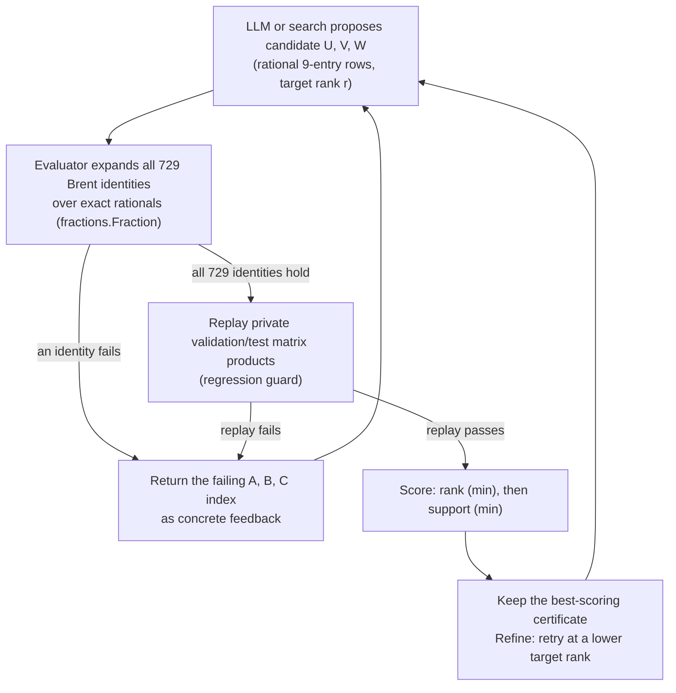

# 3 by 3 Matrix Multiplication Tensor Rank

_A hunt for the fewest exact multiplications needed to multiply two 3 by 3 matrices, verified by machine-checkable identities rather than by trust._

## ELI5

Imagine two tiny grids of 9 numbers each, like two small Sudoku boards, and you want to combine them the matrix multiplication way to get a third grid of 9 numbers. The plain schoolbook way needs 27 separate multiplications. In 1969 a mathematician named Strassen showed that clever combining tricks can sometimes cut that number down. For 3 by 3 grids, the best known trick, found by Laderman in 1976, uses 23 multiplications instead of 27. Nobody knows for certain whether an even shorter recipe, using 22 or fewer, exists. This hill asks teams to either find that shorter recipe or find a cleaner 23-multiplication one, and a computer checks every claim by expanding it out and comparing it term by term against the true answer, so nobody can bluff their way to a score.

## The exact task on AutoLab

A team submits a directory containing exactly one file, `solution.json`, with three fields `u`, `v`, and `w`, each a list of the same number of rows (between 1 and 40 rows), each row exactly 9 exact rational coefficients (an integer, or `[numerator, denominator]` with a positive denominator, magnitudes at most 1,000,000). Row `t` of `u` and `v` defines `L_t(A) = sum_i U[t][i] A[i]` and `R_t(B) = sum_j V[t][j] B[j]` over the 9 row-major entries of inputs `A` and `B`; their product `M_t = L_t(A) R_t(B)` is one bilinear term, and output entry `C[row][column]` is reconstructed as `sum_t W[t][k] M_t` with `k = 3 * column + row` (column-major). The evaluator (eval.py of AutoLab hill https://app.autolab.ai/hills/alejandrozu/matrix-multiplication-tensor-3x3) never executes submission code: it parses the JSON into exact `fractions.Fraction` coefficients and checks all 729 Brent identities, one for every combination of 9 `A` indices, 9 `B` indices, and 9 `C` indices, symbolically. It then replays disjoint private concrete matrix products (`validation.json` normally, `test.json` under `--final`, run as `hills eval <submission> -H matrix-multiplication-tensor-3x3 --final`) as a regression guard on top of, not instead of, the symbolic check. Two metrics are reported: `rank` (row count of `u`/`v`/`w`, minimize) and `support` (total nonzero coefficients across `u`, `v`, `w`, minimize, a compactness tie-breaker only). Hill version is `0.1.0`, spec version 2, watchdog 120 seconds.

## Why this problem matters

Schoolbook multiplication of two n by n matrices costs order n^3 scalar multiplications; Strassen's 1969 trick recurses a small base-case algorithm to beat n^3 overall, and the resulting matrix-multiplication exponent, omega, is a famous open question in algebraic complexity. Small base cases matter because block recursion inherits whatever rank the base case achieves. Wikipedia's article on the computational complexity of matrix multiplication states that the best known non-commutative algorithm for 3 by 3 uses 23 multiplications, that a general lower bound (Blaser, 2mn + 2n - m - 2 for m >= n >= 3) gives at least 19 for n = 3, and that a separate computer-assisted proof raised the 3 by 3 lower bound to 20 specifically over the field Z/2Z (Wikipedia, Computational complexity of matrix multiplication). In the field's own words, 3 by 3 is the smallest square case whose exact rank is unknown. That gap between roughly 19 and 23 is what this hill probes, and the AI angle is specific: a model or search procedure can propose enormous numbers of candidate factorizations, but only an exact symbolic checker like the 729-identity evaluator can separate a genuine decomposition from an almost-right guess, since exact rational identities leave no room for approximate matches. The same underlying tensor also connects to this event's other featured hill: a 2017 paper argues that the matrix-multiplication exponent and the Grothendieck constant are different size measures of the same matrix-multiplication tensor object (arxiv.org/abs/1711.04427); see the companion page at ../problems/05-grothendieck-constant-witnesses.md.

## Where the frontier is

The bundle's leaderboard snapshot, dated 2026-09-27 around 11:40 EDT, reports 4 entries with scores `rank=23 support=139`, `rank=23 support=139`, and `rank=23 support=153` (the bundle lists three distinct score tuples against a stated count of four entries; that mismatch is quoted as given, not reconciled here). No listed entry has reached rank 22. The bundle states Laderman's rank-23 decomposition is the supplied baseline and that "a rank-22 certificate would be a major result."

## What a hill score proves, and what it does not

A passing submission is a finite, exact construction: the 729 Brent identities are a complete symbolic check across every output and input coordinate, not a sample, so a pass proves a specific 23-row (or, if achieved, 22-row) bilinear algorithm correctly multiplies every pair of 3 by 3 matrices over the rationals. It proves nothing about 4 by 4 or larger matrices and does not touch the general omega question. Per the handbook's partial-credit table, this is exhaustive finite computation: the handbook states that exhaustive finite results require a formal certificate or verified procedure and may justify credit at the appropriate scope, often bands P1 through P3, and that sampling does not prove an uncovered infinite statement (handbook.txt, Section 5). Whether a rank-22 witness scores as its own complete result or as partial credit toward a bigger family depends on how the target gets registered; the handbook notes "a variation receives its own difficulty, not its parent's" (Section 3.2), and that classification call is for the reviewers, not this page, to make.

## How an AI loop attacks it

An LLM proposes symbolic or numeric entries for `U`, `V`, `W`, often guided by known structure such as Strassen-style commutative tricks or a search over sparsity patterns; a computer algebra system such as Wolfram, or a Python or SymPy harness, can pre-check candidate identities cheaply before the official evaluator runs. The evaluator's error message, which names the exact failing `(A_index, B_index, C_index)` triple, is precise feedback the next generation round can target directly, rather than a vague pass or fail. Lean does not perform the numeric search itself, but it can certify a winning candidate once found, which is the next section's subject.

## The Lean route

This hill's own score is a computational check, not a Lean proof: the evaluator is Python code using `fractions.Fraction`, and passing it certifies that a specific 729-identity symbolic check succeeded, nothing about the Lean kernel. The bundle's README carries no separate trust-boundary note beyond stating the evaluator "never executes submission code" and expands every identity exactly. Compare that to this event's dedicated Lean hill, `erdos-3`: there the submission is only a proof term appended after a fixed theorem statement ending in `:=` (statement.lean of AutoLab hill https://app.autolab.ai/hills/ottogin/erdos-3), the evaluator concatenates statement and proof, appends `#print axioms hill`, and requires Lean to compile it with no `sorry` and no axioms beyond `propext`, `Classical.choice`, and `Quot.sound` (eval.py of AutoLab hill https://app.autolab.ai/hills/ottogin/erdos-3).

A team wanting to add a Lean layer to a winning matrix-multiplication candidate would state a theorem of this shape: for all rational 9-tuples `A` and `B`, the reconstructed output `sum_t W[t][k] * (sum_i U[t][i] A[i]) * (sum_j V[t][j] B[j])` equals the schoolbook product entry, for each of the 9 output coordinates `k`, with `U`, `V`, `W` filled in as the exact literal rationals from the winning `solution.json`. Both sides are polynomials in the 18 free variables `A[0..8]` and `B[0..8]` with fixed rational coefficients, so this is exactly the kind of identity Lean's `ring` tactic is built to discharge by normalizing both sides inside the kernel, with no trust beyond the three standard axioms; there is no need for native evaluation here, since nothing needs to be evaluated at a single numeric point rather than proved symbolically. If a team instead tried to check the identity by plugging in many concrete integer matrices and evaluating numeric equalities by native evaluation (`decide +native`, formerly written `native_decide`), they should know that Lean's own reference documentation states that `decide +native` "uses the native code compiler (`#eval`) to evaluate the `Decidable` instance, admitting the result via an axiom," that up to Lean 4.28.0 such uses show up as an axiom `Lean.trustCompiler` in `#print axioms`, and that since Lean 4.29.0 the `decide +native` and `bv_decide` tactics introduce one dedicated axiom for each computation (lean-lang.org, ValidatingProofs). Plain `decide` and `decide +kernel` remain checked entirely by the kernel. `ring` avoids native evaluation entirely and is the right tool for this specific finite polynomial identity.

The 729 Brent identities themselves are a different, smaller kind of check once `U`, `V`, `W` are fixed to specific literal rationals: each identity is just an equality between two concrete rational numbers, not a statement quantified over `A` and `B`, so it is decidable by direct computation rather than symbolic normalization. Tested locally by the author on 2026-09-27, core Lean 4.34.1 with no Mathlib proved all 729 Brent identities for Laderman's rank-23 scheme using `decide +kernel` in about 3 seconds of compile time, and `#print axioms` listed only `propext`, meaning no native evaluation or extra trust was needed for that specific finite check. That is a genuinely different formalization target from the universally-quantified `ring` theorem above: it certifies that the literal Laderman numbers satisfy the 729 identities, not that the general polynomial identity holds for every `A` and `B`, though both routes independently establish that the same underlying algorithm is correct.

Per the computation band quoted above, a Lean-backed rank-23 or rank-22 witness would likely land in P1 to P3, and the judges decide the exact coefficient and family assignment. General Lean and Mathlib setup guidance lives at ../tools/lean-4-and-mathlib.md; the scoring rules referenced above are in ../docs/competition-rules.md.

## A realistic plan for a Sundai team

For the Sundai kickoff day itself, with a demo at 20:00, a realistic target is reproducing Laderman's rank-23 scheme and trying to compress its support below the leaderboard's 139, or running a structured search seeded by known Strassen-style tricks toward rank 22, with the honest expectation that rank 22 has resisted search for decades. Wrapping a found rank-23 candidate in a `ring`-proved Lean theorem is achievable within a day and produces a genuine, if modest, formalization artifact. For the full OpenMath week, ending before 00:00 EDT Saturday, 3 October 2026, the odds of a genuine rank-22 certificate are low given how long this exact gap has stood, but an incremental support-compressed rank-23 construction, or a Lean-certified version of an existing rank-23 scheme, is a realistic and checkable deliverable regardless of the headline result.

## Atlas difficulty profile

The closest Ulam OPDP Atlas v1.6 record by title search is `AMR-030-0086`, "Is the exponent of matrix multiplication 2," which the bundle explicitly flags may be the parent problem, not the exact hill task. Its recorded numbers, copied verbatim: difficulty_label "T3 Serious Project", intrinsic_difficulty_0to10 5.2, intrinsic_range low 3.4 / high 7, ai_difficulty_0to10 3.7, ai_fit "AI-favored", tractability "T6", progress_probability "40-55%", verification_if_true 5, formalization 3.2, tool_leverage 6.8, recommended_route "Status and literature audit", catalog_status "open". These are Atlas 0-10 scores; the competition's own D(P) is a separate 0-1000 scale supplied by organizers and is not computed or estimated here.

## Sources

- AutoLab hill https://app.autolab.ai/hills/alejandrozu/matrix-multiplication-tensor-3x3 (README, hill.yaml and leaderboard snapshot of 27 Sep 2026)
- eval.py of AutoLab hill https://app.autolab.ai/hills/alejandrozu/matrix-multiplication-tensor-3x3
- OpenMath Competition and Judging Handbook, https://rsihouse.ai/openmath/handbook.pdf
- talk "Programming in Lean" (Alejandro Zarzuelo Urdiales, OpenMath 2026)
- https://rsihouse.ai/openmath
- statement.lean of AutoLab hill https://app.autolab.ai/hills/ottogin/erdos-3
- eval.py of AutoLab hill https://app.autolab.ai/hills/ottogin/erdos-3
- https://en.wikipedia.org/wiki/Computational_complexity_of_matrix_multiplication
- https://lean-lang.org/doc/reference/latest/ValidatingProofs/
- https://arxiv.org/abs/1711.04427
