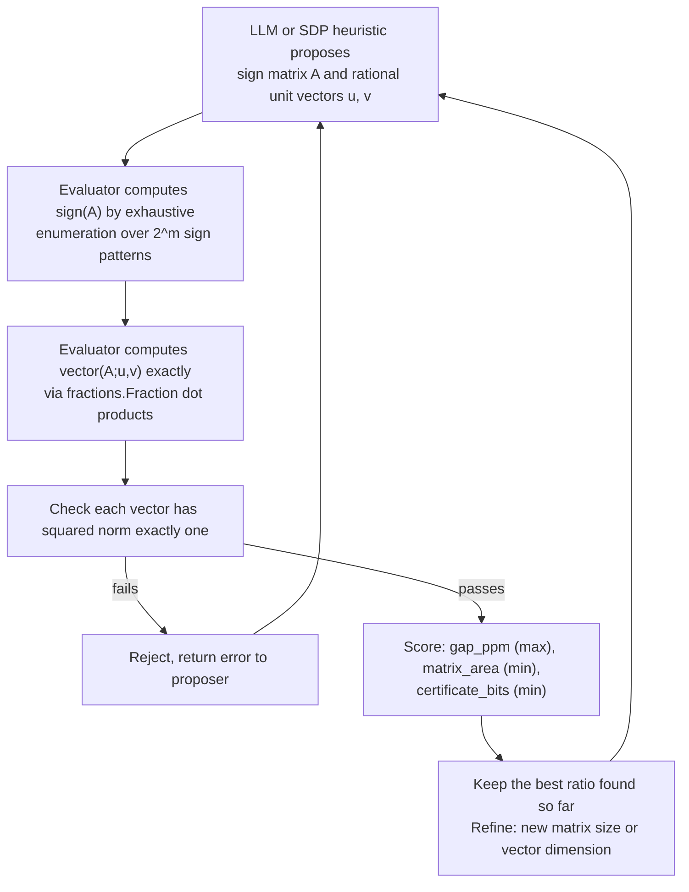

# Grothendieck Constant Witnesses

_A search for small, exact, rational certificates that prove a lower bound on a famous unknown constant from functional analysis._

## ELI5

Picture a tug of war grid: several people on team X and several on team Y, and every X-Y pair either helps or hurts each other by a fixed amount. If everyone can only pull "forward" or "backward" (plus one or minus one), there is some best possible total score, called `sign`. Now imagine instead that each person can point their pull in any direction in space, like an arrow, as long as the arrow has length exactly one; combining those arrow directions cleverly can sometimes beat the plain plus-or-minus-one game. The Grothendieck constant asks exactly how much better the arrow game can ever get compared to the plus-or-minus game, in the worst possible tug-of-war setup, and nobody knows its exact value. This hill does not ask for that exact value. It only asks teams to build one small, fully checkable tug-of-war grid plus arrow directions that proves the arrow game beats the plain game by a specific, certified amount.

## The exact task on AutoLab

A team submits a directory with one file, `solution.json`, containing exactly `matrix`, `left_vectors`, and `right_vectors`. `matrix` is an m by n array of entries that are each exactly `-1` or `1`, with `2 <= m, n <= 8`. `left_vectors` has m rows and `right_vectors` has n rows, all sharing one dimension `d` with `2 <= d <= 16`; every coordinate is a canonical rational pair `[numerator, denominator]`, coprime, positive denominator, magnitude at most 1,000,000, and every vector must have squared Euclidean norm exactly one, checked with `fractions.Fraction` (floats are invalid). The evaluator (eval.py of AutoLab hill https://app.autolab.ai/hills/alejandrozu/grothendieck-constant-witnesses) never runs submission code. It computes `sign(A) = max` over all `{-1,1}` sign choices `x_i, y_j` of `sum_ij A_ij x_i y_j` by exhaustive enumeration over one side's `2^m` mask values, and computes `vector(A;u,v) = sum_ij A_ij <u_i, v_j>` exactly. Three metrics: `gap_ppm` (`floor(1,000,000 * vector/sign)`, maximize, a certified lower bound on the real Grothendieck constant K_G scaled by a million), `matrix_area` (`m*n`, minimize), and `certificate_bits` (sum of numerator and denominator bit lengths across all vector coordinates, minimize). Reports rank lexicographically on those three in that order. Held-out `validation.json`/`test.json` fixtures guard the evaluator's own exact arithmetic, checked via `--final`; they are not hidden targets to be matched. The bundle's own worked example is the 2 by 2 CHSH sign matrix `[[1,1],[1,-1]]`, with `sign(A)=2`, vector objective `14/5`, and lower bound `7/5`. Hill version `0.1.0`, spec version 2, watchdog 120 seconds.

## Why this problem matters

The real Grothendieck constant, K_G, is the exact supremum of how much a vector relaxation of a signed bilinear optimization can beat the plain plus-or-minus-one version; its precise value has been open since Grothendieck's 1953 inequality. The Atlas record for this area is literally titled "10 Lectures and 42 Open Problems - The Grothendieck Constant" with the statement "What is the value of the (real) Grothendieck constant?" The bound `pi / (2 * ln(1 + sqrt(2)))`, approximately 1.782213978, is known in the literature as Krivine's bound: that is the paper's own title, "The Grothendieck constant is strictly smaller than Krivine's bound," by Braverman, Makarychev, Makarychev, and Naor, whose abstract states "We prove that K_G < pi/(2 log(1+sqrt(2)))" (arxiv.org/abs/1103.6161). This bundle found no anchored source attributing a specific 1977 date to that bound, so no date is stated here. The exact value of K_G, and any matching construction that would pin it down from below, remains unresolved. On the AI side, a separate paper frames the Grothendieck constant and the matrix-multiplication tensor exponent (the subject of this event's other featured hill) as different size measures of the same underlying tensor object (arxiv.org/abs/1711.04427); see ../problems/04-matrix-multiplication-tensor-3x3.md. Search matters here because good witnesses plausibly come from semidefinite-programming-style vector relaxations, which are naturally amenable to numeric optimization before exact rationalization and formal verification.

## Where the frontier is

The bundle's leaderboard snapshot, dated 2026-09-27 around 11:40 EDT, lists 2 entries: `gap_ppm=1414213 matrix_area=4 certificate_bits=80` and `gap_ppm=1414213 matrix_area=4 certificate_bits=86`. Both use the smallest allowed matrix area (`m*n=4`, i.e. a 2 by 2 sign matrix), and both already beat the README's illustrative CHSH example's ratio of `7/5` (1,400,000 in the same scaled units) with a ratio of 1.414213. This bundle number is quoted exactly as reported; any resemblance to `sqrt(2) ~= 1.41421356` is an observation about the bundle's own reported figure, not an independently verified published bound.

## What a hill score proves, and what it does not

A passing submission is a finite, fully inspectable, exact object: one integer sign matrix, exact rational unit vectors, and an exactly computed ratio that certifies `K_G >= vector/sign` for that instance. It does not prove anything about the exact value of K_G, and it does not by itself improve on any published lower bound from the literature, since this hill's bounds (`m, n <= 8`, `d <= 16`) are small compared to general constructions. Per the handbook's Computation category, exhaustive finite results require a formal certificate or verified procedure and may justify credit at the appropriate scope, often bands P1 through P3; sampling does not prove an uncovered infinite statement (handbook.txt, Section 5). Resolving K_G's exact value would require a matching upper-bound construction as well, which is a separate and much harder mathematical task than this hill's search.

## How an AI loop attacks it

A practical loop lets a semidefinite-programming solver or Wolfram find near-optimal real-valued unit vectors for a chosen small sign matrix, then an LLM or a continued-fraction routine rationalizes those floats into exact, coprime rational coordinates within the coordinate bound, and the Python evaluator checks norm-one and the exact ratio. Because `sign(A)` for `m, n <= 8` is only `2^m <= 256` cases, brute-force exact enumeration is cheap and gives a hard number to optimize against; the feedback that flows back is simply pass or fail plus the three exact metric values, which is enough for the next generation round to try larger matrices or lower-bit-length vectors.

## The Lean route

This hill's score, like the matrix-multiplication hill, is a computational check, not a Lean proof: the evaluator is Python using `fractions.Fraction`, and it never runs submission code. The README carries no separate trust-boundary note beyond describing that arithmetic. A team could still state a Lean theorem about an exact witness: for the specific integer sign matrix `A` and specific rational unit vectors `u`, `v` from a winning `solution.json`, the finite maximum `sign(A)` over all `{-1,1}^m` sign assignments equals a specific integer, and `sum_ij A_ij * <u_i, v_j>` equals a specific rational value exactly, so their ratio is at least the claimed `gap_ppm / 1,000,000`. The `sign(A)` computation is a finite maximum over a `2^m`-element, at most 256-element, decidable search space, which Lean's kernel can in principle discharge directly with `decide` at that size; a team reaching for native evaluation (`decide +native`, formerly written `native_decide`) for speed should know, per Lean's own reference documentation, that it "admitting the result via an axiom": that axiom is `Lean.trustCompiler` in Lean versions up to 4.28.0, and since Lean 4.29.0 the mechanism instead "introduce[s] one dedicated axiom for each computation" (lean-lang.org, ValidatingProofs). The unit-norm and dot-product checks are themselves exact rational arithmetic equalities that `norm_num` or `decide` on the literal fractions can typically discharge without native code. This page does not name specific Mathlib declarations for any of this, since none were verified on a fetched Mathlib documentation page. Per the computation band quoted above, a Lean-backed finite witness would likely land in P1 to P3, and the judges decide the exact coefficient.

Tested locally by the author, not from the bundle itself: an exact 2 by 2 CHSH witness for this hill, sign matrix `[[1,1],[1,-1]]` with unit vectors `u = (-195/197, -28/197), (28/197, -195/197)` and `v = (-3/5, -4/5), (-4/5, 3/5)`, scored `gap_ppm=1414213` with `certificate_bits=80` under the hill's own evaluator functions, matching the certificate_bits=80 entry on the bundle's leaderboard snapshot above. The corresponding finite claims (the `sign(A)` maximum, the exact rational dot products, and the unit-norm equalities) were checked in core Lean 4.34.1, with no Mathlib import, in about 1.7 seconds, and `#print axioms` on the result listed only `propext`.

## A realistic plan for a Sundai team

For the Sundai kickoff day, with a demo at 20:00, a realistic goal is reproducing or modestly beating the current leaderboard's 2 by 2 witness (already above the README's illustrative example), or trying a slightly larger 3 by 3 or 4 by 4 sign matrix with a quick numeric vector search followed by rationalization; wrapping the resulting small, finite `sign(A)` computation in a `decide`-checked Lean theorem is plausible within a day given how small these instances are. For the full OpenMath week, ending before 00:00 EDT Saturday, 3 October 2026, meaningfully closing in on the published upper-bound region near 1.78 is unlikely for a small team working from scratch, but incremental, well-certified small witnesses, ideally with a Lean-checked finite computation attached, are realistic and genuinely useful deliverables regardless of how far they are from the exact constant.

## Atlas difficulty profile

The closest Ulam OPDP Atlas v1.6 record by title search is `AMR-027-0803`, "10 Lectures and 42 Open Problems - The Grothendieck Constant," which the bundle explicitly flags may be the parent problem, not the exact hill task (the hill only asks for finite witnesses, not the exact constant). Its recorded numbers, copied verbatim: difficulty_label "T3 Serious Project", intrinsic_difficulty_0to10 5.4, intrinsic_range low 3.6 / high 7.2, ai_difficulty_0to10 4.9, ai_fit "ai-neutral/mixed", tractability "T5", progress_probability "25-40%", verification_if_true 5.4, formalization 4.2, tool_leverage 4.5, recommended_route "Status and literature audit", catalog_status "open". These are Atlas 0-10 scores; the competition's own D(P) is a separate 0-1000 scale supplied by organizers and is not computed or estimated here.

## Sources

- AutoLab hill https://app.autolab.ai/hills/alejandrozu/grothendieck-constant-witnesses (README, hill.yaml and leaderboard snapshot of 27 Sep 2026)
- eval.py of AutoLab hill https://app.autolab.ai/hills/alejandrozu/grothendieck-constant-witnesses
- OpenMath Competition and Judging Handbook, https://rsihouse.ai/openmath/handbook.pdf
- talk "Programming in Lean" (Alejandro Zarzuelo Urdiales, OpenMath 2026)
- https://rsihouse.ai/openmath
- statement.lean of AutoLab hill https://app.autolab.ai/hills/ottogin/erdos-3
- eval.py of AutoLab hill https://app.autolab.ai/hills/ottogin/erdos-3
- https://arxiv.org/abs/1103.6161
- https://arxiv.org/abs/1711.04427
- https://lean-lang.org/doc/reference/latest/ValidatingProofs/
- Tested locally by the author (2026-09-27): the CHSH witness gap_ppm/certificate_bits figures and the core-Lean 4.34.1 check described in the Lean route section above are the author's own local run, not part of the bundle.
</content>
