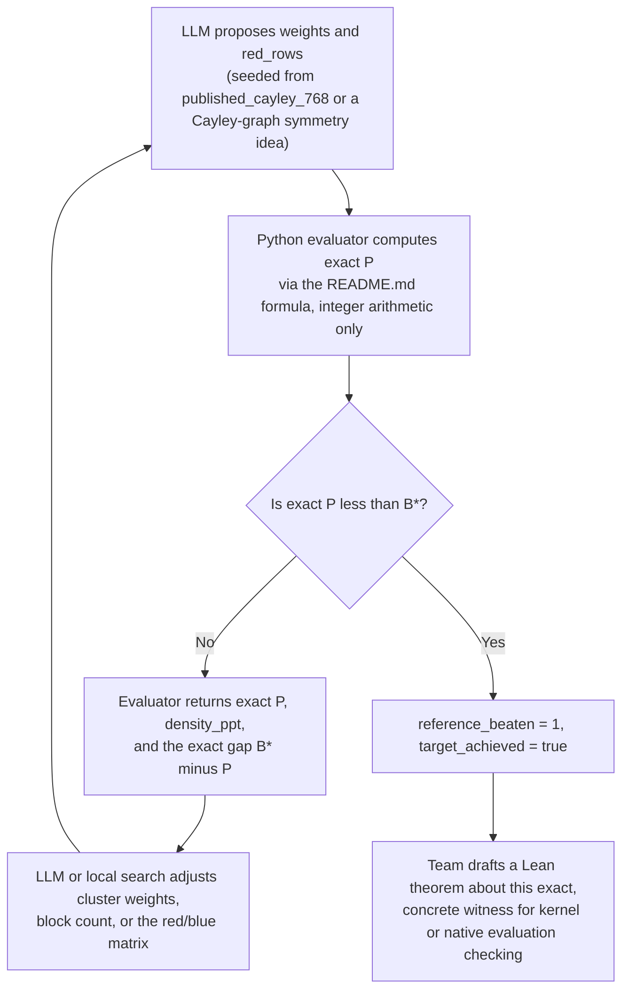

# Clique clusters and K4 Ramsey multiplicity

_This hill asks teams to build an explicit, arbitrarily large red or blue two colored complete graph whose share of same colored four vertex cliques is proven, by exact integer arithmetic, to beat the best published density bound._

## ELI5

Imagine a giant map where every pair of kids is joined by a red string (best friends) or a blue string (rivals), and every pair has exactly one string, no gaps. Pick any four kids on the map: sometimes all six strings between them happen to be the same color, call that a matching foursome. No matter how you color a big enough map, you cannot avoid some matching foursomes. The open question is, what is the smallest possible share of matching foursomes once the map has huge numbers of kids? Mathematicians found a trick: group kids into color coded clusters, write one small recipe, then copy the recipe over and over to build maps as big as you like, and every copy keeps the same share. This hill asks a team to invent a cluster recipe whose share beats the best published recipe, and a computer referee checks the exact fraction with whole number arithmetic, never rounding.

## The exact task on AutoLab

The hill is `alejandrozu/clique-cluster-ramsey-multiplicity` (https://app.autolab.ai/hills/alejandrozu/clique-cluster-ramsey-multiplicity), hill.yaml spec_version 2, version 1.0.0. A submission is a directory holding a regular, non symlink `solution.json` (at most 4 MiB) with exactly three keys: `schema` (fixed value `weighted-two-color-blowup-v1`), `weights` (a list of 1 to 1024 integers, each from 1 to 65535), and `red_rows` (n binary strings encoding a symmetric n by n matrix A; for i not equal j, `A_ij=1` means all inter block edges are red and 0 means blue; the diagonal `A_ii=1` makes block i a red clique and `A_ii=0` a blue clique). Expanding block i to t times w_i vertices for every positive integer t defines an infinite family of graphs G_t. The evaluator computes the exact limiting density P as a reduced fraction using the formula in README.md, dividing the weights by their greatest common divisor first, and reports two metrics: `reference_beaten` (maximize; 1 if and only if the exact rational P is strictly less than the reference B\* = 10486266368/768^4, approximately 0.030142273431942788, else 0) and `density_ppt` (minimize; ceil(10^12 times P), an integer upper rounding in parts per trillion). Ranking is lexicographic on these two metrics. Verification has a 480 second internal limit and 600 second watchdog. The evaluator reads only solution.json and never executes submission code; other files (search code, proof notes, formal artifacts) do not change the score. Commands are `hills eval <submission> -H clique-cluster-ramsey-multiplicity` and the same with `--final`.

## Why this problem matters

Color every edge of a large complete graph red or blue and let M4(G) count four vertex subsets whose six edges are all one color. The Ramsey multiplicity constant c4 is the limit, as n grows, of the smallest possible share of such monochromatic foursomes over all n vertex graphs; its exact value is open in the literature the bundle inspected. This is a genuinely different quantity from the classical, small graph Ramsey numbers that Ramsey's theorem guarantees exist for any two colors and any target clique sizes (background: Wikipedia, Ramsey's theorem, https://en.wikipedia.org/wiki/Ramsey%27s_theorem, which discusses Ramsey numbers generally but does not mention Ramsey multiplicity or a multiplicity constant at all). The bundle's target reference bound, B\*, comes from the final note of Parczyk, Pokutta, Spiegel and Szabo's paper, which improves on their own headline theorem using a construction attributed to McKay. That paper's abstract (arXiv:2206.04036, https://arxiv.org/abs/2206.04036) describes exactly the AI relevant angle: the authors improved upper bounds on Ramsey multiplicity for K4 and K5 using "a fully computer assisted approach" where extremal constructions are "blow ups of a graph of constant size... found through search heuristics," with lower bounds separately established by flag algebras. That is the same propose, blow up, and verify pattern this hill turns into a scorable loop: search over finite cluster templates, expand them into an infinite family, and let exact arithmetic (not a heuristic score) decide whether a template actually improves the bound.

## Where the frontier is

Leaderboard snapshot (2026-09-27, ~11:40 EDT, from the bundle): `clique-cluster-ramsey-multiplicity [protocol=k4-weighted-blowup-v1, reference=10486266368/768^4] entries=3: reference_beaten=1 density_ppt=30141720824 (2026-09-25); reference_beaten=1 density_ppt=30141721098; reference_beaten=0 density_ppt=30142649543`. Two of the three existing entries already have `reference_beaten=1`, meaning their exact density is already below B\*. The bundle's supplied published seed, `examples/published_cayley_768/solution.json`, has exact density 4551721/(2^24\*9), which the bundle states plainly "does NOT beat B\*"; B\* itself is stronger than the paper's headline Theorem 1.1 bound of 4551721/(2^24\*9) (the bundle notes reproducing that headline theorem alone is not research progress against B\*).

## What a hill score proves, and what it does not

A valid certificate with exact P less than B\* gives a checked candidate upper bound, c4 less than or equal to P less than B\*, via the elementary blow up argument in LIFTING.md (an ordinary mathematical proof, not a proof assistant artifact, as LIFTING.md says explicitly). It does not touch the matching lower bound, so it never resolves the exact value of c4: the evaluator always reports `parent_problem_resolved=false`, and the bundle states a record improvement "does not resolve the exact-value problem." This mirrors the distinction the Sundai deck's Kobon triangles slide draws between a finite construction (a lower bound), a finite optimum (needs a matching upper bound), and a general theorem (needs an argument for every case, paraphrasing slide 10 of deck2.txt). Under the OpenMath handbook's Computation category, exhaustive finite results require a formal certificate or verified procedure and may justify credit at the appropriate scope, often bands P1 through P3 (handbook.txt section 5), a band far short of full credit, which requires the exact registered target completely proved.

## How an AI loop attacks it

Concretely: the LLM proposes a candidate `weights`/`red_rows` pair, perhaps a perturbation of the published Cayley seed or a new symmetry group; the Python evaluator (the only trusted judge) returns the exact fraction P, never a heuristic score; if P is not below B\*, the exact gap and the red and blue integer counts feed back into the next proposal, guiding local search, simulated annealing, or symmetry informed constructions over up to 1024 blocks; once a certificate clears B\*, the winning matrix becomes the fixed witness for the Lean route below. A computer algebra system has a supporting role here, for example exploring which finite symmetry groups (Cayley style constructions) are worth trying, but it is not part of the trust boundary; only the pinned Python evaluator's exact arithmetic decides `reference_beaten`.

## The Lean route

Be precise about what this hill is and is not. Its own README says plainly: "The Python checker and mathematical lifting argument are the computational trust boundary. Passing is not a claim of Lean/Coq verification or competition admission." A `reference_beaten=1` certificate is a Python integer computation plus an ordinary written proof (LIFTING.md), not a Lean proof of anything.

What a team can still do in Lean is state and check a theorem about its exact winning witness. Once a certificate is fixed (concrete integers m, weights w_1..w_m, and a concrete symmetric bit matrix A), the sum defining P in README.md is a finite arithmetic expression over `Fin m`, so a team can write a Lean theorem such as "the rational number computed by this fixed finite sum equals p/q" or "this fixed finite sum is less than 10486266368/768^4," where every quantity is a Lean numeral, not a free variable. Because the statement is about one fixed finite structure, the comparison is a `Decidable` proposition, and in principle the Lean kernel can discharge it by direct reduction (`decide`) or by `norm_num`-style rational arithmetic. In practice, the nested sum in README.md ranges over ordered 4-tuples of up to 1024 blocks, so a literal kernel `decide` over that many cases could be far too slow, which is exactly the situation native evaluation (`decide +native`, formerly written `native_decide`) exists for: it evaluates the same decidable check using compiled code instead of kernel reduction.

Mathlib's own vocabulary for cliques is real but only a partial fit, verified on its docs page (Mathlib.Combinatorics.SimpleGraph.Clique, https://leanprover-community.github.io/mathlib4_docs/Mathlib/Combinatorics/SimpleGraph/Clique.html): `SimpleGraph.IsNClique` defines an n-clique as a set of n pairwise adjacent vertices, `SimpleGraph.cliqueFinset` collects all n-cliques of a graph into a `Finset`, and `SimpleGraph.CliqueFree` says a graph has no n-cliques. The docs page confirms a decidability instance for `IsNClique` given `DecidableEq` on vertices and a decidable adjacency relation (`instDecidableIsNCliqueOfDecidableEqOfDecidableRelAdj`); it does not state an equivalent decidability instance for `CliqueFree` on that page, so this page does not claim `CliqueFree` is decidable. That machinery describes a single, concrete `SimpleGraph` on a `Fintype` of vertices; it does not, as far as this session verified, supply a ready made blow up or template lemma connecting one finite certificate to the whole family G_t for every t. A team wanting a Lean statement about the actual infinite family, not just one large instance, would need to formalize the LIFTING.md argument itself; formalizing only one fixed, large G_t with `SimpleGraph.CliqueFree`/`IsNClique` machinery checks a single finite graph, not the limit.

The trust caveat matters and is confirmed, not assumed: Lean's own reference documentation on axioms (https://lean-lang.org/doc/reference/latest/Axioms/, fetched directly) states that native evaluation "creates a bespoke axiom for each invocation," and that these axioms "track proofs that depend on the correctness of the entire compiler, and not just... the kernel." That is strictly more than the three axioms this event's own Lean hill (Erdos Problem 3, see the sibling page) allows: `propext`, `Classical.choice`, and `Quot.sound`. This construction hill's evaluator never inspects Lean or axiom lists at all, so a native-evaluation dependency would not fail this specific hill; but the OpenMath handbook (handbook.txt section 7.1) requires every score bearing artifact to disclose "declared axioms/dependencies," so an undisclosed native-evaluation trust gap would be a real problem for review.

What this buys, if a team does it cleanly: a certified, finite, exact fact about one witness. Per the handbook's partial credit table (section 5), that kind of "narrow certified computation" typically sits in band P1 (0.01 to 0.05) or, if the Lean work actually reconstructs the LIFTING.md argument into a genuine formalized infinite family bound, band P3 (0.15 to 0.35, "meaningful infinite family, special case, bound, or structural advance"). The judges, not the team, choose the band and coefficient (handbook section 5: two independent judges propose a band, and a large disagreement requires a third reviewer).

## A realistic plan for a Sundai team

On kickoff day, with a demo at 20:00, a realistic goal is: get `hills eval` running locally, reproduce the published Cayley 768 seed exactly (density 4551721/(2^24\*9), confirmed short of B\*), then spend remaining hours trying small perturbations or a different symmetry group and reporting the best exact density found, honestly labeled as a reproduction plus a documented search direction rather than a claimed record. For the OpenMath week (through the deadline before 00:00 EDT on Saturday, 3 October 2026), a team can run a heavier search (simulated annealing or a targeted Cayley graph family) toward `reference_beaten=1`; the bundle itself calls breaking B\* "the stretch goal," not an expected outcome, and separately notes that a useful week can also produce "a reviewed structural lemma or reusable formalization" even without beating B\*. If a certificate does clear B\*, formalizing that single witness in Lean (as above) is a concrete, achievable side deliverable for the handbook's separate formalization credit, distinct from, and smaller than, resolving c4 itself.

## Atlas difficulty profile

The bundle states directly: "No Atlas v1.6 record found by title search. Do not invent a difficulty score." No Atlas record is used for this page.

## Sources

- AutoLab hill https://app.autolab.ai/hills/alejandrozu/clique-cluster-ramsey-multiplicity (README, hill.yaml and leaderboard snapshot of 27 Sep 2026) (ground truth bundle: README, LIFTING.md, SOURCES.md, hill.yaml, leaderboard snapshot, Atlas note, deck slide text)
- eval.py of AutoLab hill https://app.autolab.ai/hills/alejandrozu/clique-cluster-ramsey-multiplicity (evaluator source)
- LIFTING.md of AutoLab hill https://app.autolab.ai/hills/alejandrozu/clique-cluster-ramsey-multiplicity (elementary blow up proof)
- SOURCES.md of AutoLab hill https://app.autolab.ai/hills/alejandrozu/clique-cluster-ramsey-multiplicity (literature selection and baseline)
- OpenMath Competition and Judging Handbook, https://rsihouse.ai/openmath/handbook.pdf (sections 4, 5, 7: scoring, partial credit bands, tools and Autolab)
- talk "Programming in Lean" (Alejandro Zarzuelo Urdiales, OpenMath 2026) (slide 10, Kobon triangles: construction vs optimum vs general theorem)
- https://rsihouse.ai/openmath (event dates)
- https://arxiv.org/abs/2206.04036 (Parczyk, Pokutta, Spiegel, Szabo abstract: computer assisted search heuristics and flag algebras)
- https://en.wikipedia.org/wiki/Ramsey%27s_theorem (background on Ramsey numbers; confirms no mention of Ramsey multiplicity)
- https://leanprover-community.github.io/mathlib4_docs/Mathlib/Combinatorics/SimpleGraph/Clique.html (IsNClique decidability instance confirmed; CliqueFree decidability not confirmed on this page)
- https://lean-lang.org/doc/reference/latest/Axioms/ (native evaluation's per-proof axiom and compiler trust)
</content>
