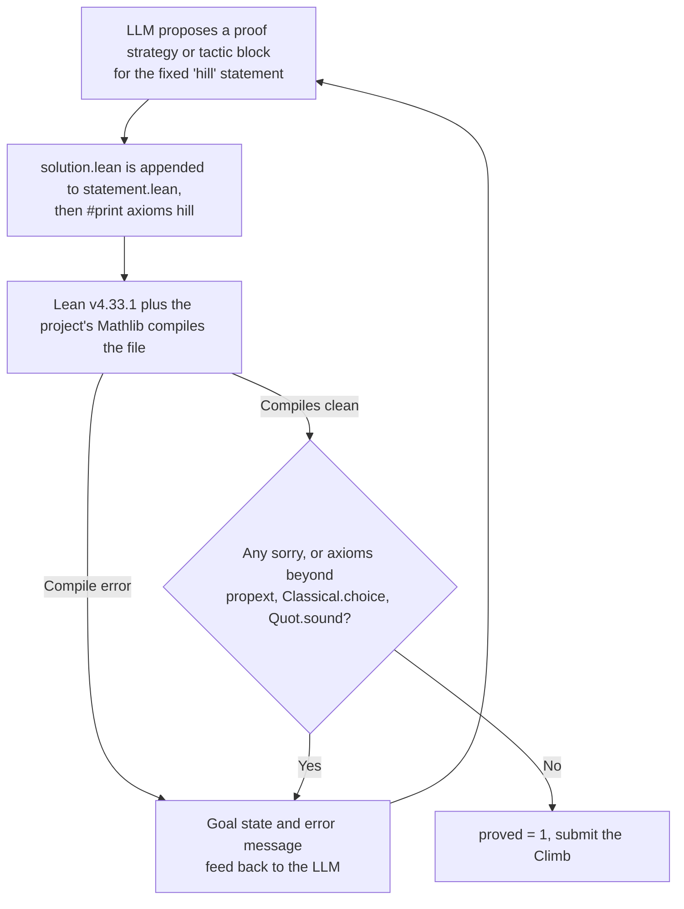

# Erdős Problem #3 (arithmetic progressions in dense-sum sets)

_This hill asks teams for a complete, machine checked Lean proof of an open Erdős conjecture: that any set of natural numbers whose reciprocals sum to infinity must contain arithmetic progressions of every length._

## ELI5

Pick a special list of counting numbers, like 2, 3, 5, 8, and so on, and add up one divided by each number: one half, plus one third, plus one fifth, plus one eighth, forever. If that running total never settles down and instead keeps climbing toward infinity, mathematicians call the list "heavy enough." Erdős guessed that any heavy enough list is automatically stuffed with hidden patterns called arithmetic progressions, evenly spaced numbers like 3, 7, 11, 15. It is a bit like saying: if your toy box never stops getting heavier as you add pieces, then somewhere inside it there must be a row of evenly spaced blocks, no matter how long a row someone asks for. Nobody has proven this always happens, and nobody has found a heavy list that breaks the pattern either, it is a real, unsolved mystery. This hill does not ask a team to solve that mystery in a week; it asks them to write a Lean proof (or explore related, smaller true facts) that a computer checks line by line, trusting no one's word.

## The exact task on AutoLab

The hill is `ottogin/erdos-3` (https://app.autolab.ai/hills/ottogin/erdos-3), hill.yaml spec_version 3, version 0.1.0, watchdog_timeout_s 1800, running inside the pinned image `ghcr.io/ottogin/lean-mathlib@sha256:964547ad81e109c78545512867bae70b710c55d833078674878faad7de0ebb85`. A submission is a directory containing `solution.lean`, the proof (a term or a `by` tactic block) that completes the fixed theorem after its `:=`; a team must not restate the theorem or add imports, since `FormalConjecturesUtil` (importing Mathlib) is already in scope. The fixed statement, verbatim: `theorem hill : answer(sorry) ↔ ∀ A : Set ℕ, (¬ Summable fun a : A ↦ 1 / (a : ℝ)) → ∃ᶠ (k : ℕ) in Filter.atTop, ∃ S ⊆ A, S.IsAPOfLength k`. The evaluator (erdos-3.eval.py) concatenates the fixed statement, the submitted proof, and `#print axioms hill`, then runs Lean 4 (toolchain v4.33.1) against the project's Mathlib build, streaming output live. It fails the attempt if `sorry`/`sorryAx` appears anywhere in the output, if Lean's return code is nonzero, if the axiom list cannot be parsed from `#print axioms hill`, or if that list contains anything beyond the three standard axioms `propext`, `Classical.choice`, and `Quot.sound`; a hard 1500 second internal timeout kills the Lean process. The single metric is `proved` (maximize; value 1.0 on a full pass, otherwise the attempt fails with a stated reason). References given in the bundle: erdosproblems.com/3, and the formalization is credited to google-deepmind/formal-conjectures.

## Why this problem matters

Erdős Problem 3 asks whether a divergent sum of reciprocals forces arbitrarily long arithmetic progressions inside the set. Fetching erdosproblems.com/3 directly confirms the problem is open, carries a $5,000 prize, and sits alongside a large family of related density results: Bloom and Sisask proved the 3-term case; Kelley and Meka later obtained much stronger quantitative bounds for that case; Green and Tao proved a bound for 4-term progressions; Gowers proved a general bound for every progression length; and Leng, Sah, and Sawhney hold the current best general bounds cited on that page. None of these results proves or disproves the exact statement here, which is about divergence of the reciprocal sum, not a density threshold on {1,...,N}; erdosproblems.com/3 also lists related problems #139, #140, and #142, and the same page connects the broader family to the Green-Tao theorem on primes containing arbitrarily long progressions. The AI angle is direct: this statement is one entry in `google-deepmind/formal-conjectures`, a public GitHub repository (confirmed by fetching its FormalConjectures/ErdosProblems/3.lean file). The project's own benchmark paper describes the repository as "an open-source and growing collection of mathematical problems formalized in Lean 4 using Mathlib" whose "benchmark focuses on open conjectures as the primary challenge, providing a zero-contamination testbed," alongside a companion goal of auto-formalizing already-solved mathematics (arxiv.org/abs/2605.13171), exactly the kind of exact, no partial credit target this hill inherits.

## Where the frontier is

Leaderboard snapshot (2026-09-27, ~11:40 EDT, from the bundle): "erdos-3: no leaderboard entries yet (0 climbs)." No team has attempted or passed this hill as of the snapshot date. The only published bounds on record, per the fetched erdosproblems.com/3 page, are the partial density results named above (Bloom-Sisask, Kelley-Meka, Green-Tao, Gowers, Leng-Sah-Sawhney); none of them is presented on that page as resolving the exact hill statement, and the bundle records no stronger claim.

## What a hill score proves, and what it does not

The fixed statement's left side is written `answer(sorry)`, using a custom Lean elaborator from `FormalConjecturesUtil`; the Formal Conjectures benchmark paper explains the distinction in its own words: "while providing a proof simply requires finding any way to replace := sorry with a valid term, providing an answer is a fundamentally different task: it requires evaluating mathematical meaning to determine the correct value" (arxiv.org/abs/2605.13171), a mechanism used across that repository to flag conjectures whose truth value is not yet asserted (for example, the repository replaces `answer(sorry)` with `answer(True)` or `answer(False)` once a problem is resolved). This session did not fetch the elaborator's own source or CONTRIBUTING.md, so exactly how `answer(sorry)` elaborates internally, and whether it can ever coexist with a `sorry`-free, passing proof of the full iff, is flagged below as an open question rather than asserted. What is certain from the evaluator: a pass requires zero `sorry` anywhere in the compiled output and an axiom list no larger than the standard three, so a genuine pass is a completely general, unconditional theorem, not a finite example, not a bound, and not a special case. That places this hill's single metric at the far end of the Kobon triangles slide's spectrum, paraphrasing deck2.txt slide 10: a finite construction gives a lower bound, a matching upper bound resolves a finite optimum, but "a result for every number of lines requires a general argument," and only the general theorem is what `proved=1` actually certifies here. Because the evaluator defines no partial metric, any adjacent partial result a team formalizes (for example, one of the cited density theorems) does not move this hill's score at all; it could only earn credit as its own separately registered contribution under the handbook's M2 (new formalization of known mathematics) or M3B (nontrivial variation) categories, never as partial progress on `erdos-3` itself.

## How an AI loop attacks it

Concretely: the LLM proposes a Lean tactic block or term proof; the harness appends it to the fixed statement plus `#print axioms hill` and runs the pinned Lean toolchain, exactly as the evaluator does; a failed compile returns Lean's own error and goal state, which is fed back as the next prompt, the same read, evaluate, refine loop as the other hill but with Lean itself as the sole judge, no Python arithmetic and no CAS in the trust boundary. A CAS such as Wolfram could help a team explore small numeric or symbolic special cases for intuition, but it checks nothing that counts toward `proved`; only Lean's kernel, via the printed axiom list, decides whether an attempt passes.

## The Lean route

This hill already is the Lean route, so the honest content is strategy and odds rather than a workaround. Because the fixed statement is equivalent to the open conjecture itself, and the README says plainly that this is an open Erdős problem, a research-level conjecture that a climber is not expected to solve yet a full, sorry-free, standard-axioms-only proof of `hill` within one week is not a realistic target; treating an attempt at the literal statement as the week's plan would be dishonest about the odds. Three more realistic Lean strategies for a team: first, formalize one of the cited partial results (for example the Bloom-Sisask or Green-Tao density bound) as its own standalone Lean theorem, aimed at the handbook's M2 or M3B categories rather than this hill's binary metric; second, formalize small, genuinely provable adjacent facts, such as explicit examples of divergent-reciprocal-sum sets and checking (in Lean, not just informally) whether an obvious finite truncation already contains a short progression, useful for building intuition and for demo material, while being clear this proves nothing about the infinite statement; third, read the statement carefully for any narrower sub-claim implied by known theorems that could be isolated and proved on its own, disclosed as a distinct, smaller contribution. On axioms: ordinary classical reasoning (excluded middle on `Set ℕ` membership, `Filter.atTop` frequently-statements) relies on `Classical.choice`, which is explicitly allowed; the real hazard is reaching for native evaluation (`decide +native`, formerly written `native_decide`; see https://lean-lang.org/doc/reference/latest/ValidatingProofs/) during exploration, since Lean's own axioms documentation (https://lean-lang.org/doc/reference/latest/Axioms/, fetched directly) confirms it "creates a bespoke axiom for each invocation" tied to trusting the whole compiler, which this evaluator's axiom filter would reject outright, exactly like a literal `sorry` would. Honest odds: close to zero for a full proof of the exact stated conjecture in one week, given it carries a standing cash prize and decades of open status per erdosproblems.com; meaningfully better odds exist for a disclosed, adjacent, formally checked partial contribution registered under the handbook's separate M2/M3B credit, not through this hill's `proved` metric.

## A realistic plan for a Sundai team

For the Sundai kickoff day, with a demo at 20:00, a defensible goal is to get one small, honestly framed, `sorry`-free Lean lemma compiling, for instance a formal statement of one cited partial result's conclusion (without necessarily reproving it from scratch) or a toy finite example related to the hypothesis, clearly presented as adjacent groundwork, not a climb of `erdos-3`. For the OpenMath week, through the submission deadline before 00:00 EDT on Saturday, 3 October 2026, continued reading of the cited literature and, if a genuinely new and nontrivial formalized fact emerges, registering it separately under the handbook's M2 or M3B process with full disclosure of tools, models, and provenance (handbook section 6 and 7.1) is the realistic ceiling; expecting to move `erdos-3`'s own `proved` metric off zero within the week would not match the bundle's own framing of the problem.

## Atlas difficulty profile

The bundle lists two Atlas v1.6 title-search matches, explicitly flagged as possibly the parent problem rather than the exact hill task, on the Atlas's own 0-10 scale (not the competition's 0-1000 D(P), which this page does not estimate). The closest title match, `EP-3` ("Erdős Problem #3"), copied verbatim: tier "T3 Serious Project", intrinsic_difficulty_0to10 6.1 (range 4.9-7.3), ai_difficulty_0to10 5.6, ai_fit "AI-neutral/mixed", tractability "T5", progress_probability "25-40%", verification_if_true 5.4, formalization 4, tool_leverage 4.5, recommended_route "Expert-guided proof search", catalog_status "open". A second, broader-framed record also appears, `NT-055` ("Erdős Conjecture on Arithmetic Progressions"): tier "T4 Frontier Challenge", intrinsic_difficulty_0to10 7.0 (range 5.8-8.2), ai_difficulty_0to10 6.5, same ai_fit/tractability/progress_probability, verification_if_true 5.3, formalization 3.5, tool_leverage 5.3, recommended_route "Expert-guided proof search", catalog_status "open". Both may describe the parent open problem rather than this specific fixed-statement Lean hill.

## Sources

- AutoLab hill https://app.autolab.ai/hills/ottogin/erdos-3 (README, hill.yaml and leaderboard snapshot of 27 Sep 2026) (ground truth bundle: README, hill.yaml, statement.lean, leaderboard snapshot, Atlas records)
- eval.py of AutoLab hill https://app.autolab.ai/hills/ottogin/erdos-3 (evaluator source)
- statement.lean of AutoLab hill https://app.autolab.ai/hills/ottogin/erdos-3 (fixed statement)
- OpenMath Competition and Judging Handbook, https://rsihouse.ai/openmath/handbook.pdf (sections 4, 5, 6, 7: scoring, partial credit bands, families and independence, tools and Autolab)
- talk "Programming in Lean" (Alejandro Zarzuelo Urdiales, OpenMath 2026) (slide 10, Kobon triangles: construction vs optimum vs general theorem)
- https://rsihouse.ai/openmath (event dates)
- https://www.erdosproblems.com/3 (statement, open status, $5,000 prize, cited partial results and related problems)
- https://github.com/google-deepmind/formal-conjectures/blob/main/FormalConjectures/ErdosProblems/3.lean (source of the formalization, confirms the `answer(sorry)` text)
- https://arxiv.org/abs/2605.13171 (Formal Conjectures benchmark paper: repository purpose and the exact wording distinguishing "providing an answer" from "providing a proof")
- https://lean-lang.org/doc/reference/latest/Axioms/ (native_decide's per-proof axiom and compiler trust)
</content>
