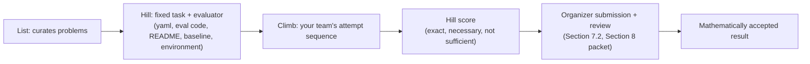

# AutoLab: Hills and Climbs
_AutoLab is the platform where OpenMath 2026 teams point a coding agent or themselves at a fixed math task and get an exact, reproducible score back._

## ELI5
Think of a hill like a locked obstacle course with a stopwatch bolted to the wall: the course (the task) and the stopwatch (the evaluator) never change once the version is set, so any team's run can be compared fairly. A climb is your team's logbook of runs up that course: every attempt, every score, every tweak. Beating your own best time on the course is real progress, but the stopwatch cannot tell you whether you climbed the right course, or whether a judge will accept the run for a medal. On AutoLab, a hill score is that stopwatch reading: necessary, checkable, and honest about the one thing it measures, but not the same as a judged, mathematically accepted result.

## What it is, precisely
The public OpenMath problem list distinguishes three layers: "A list curates problems. A hill fixes the task and evaluator. A climb records your team's attempt and experiments. A hill score measures its stated task; mathematical acceptance also requires the competition's formal artifact/certificate and review" (hills/_list_readme.md). The handbook restates the split in its required submission route: "A Hill is a versioned task/evaluator; a Climb records an attempt sequence" (handbook, section 7.2).

A hill is built from a small set of pinned parts, visible directly in the two example hill files here. `kobon-triangles.hill.yaml` declares `spec_version: 2`, a name and version, a single metric (`triangles`, direction `max`), a `watchdog_timeout_s` of 120, and a parameter `n` (default 18, integer between 3 and 100), with the note that "different n values are ranked separately." The matching `kobon-triangles.eval.py` is the actual evaluator: it reads a `solution.json` file containing only a `"lines"` array of exactly `n` integer triples, capped at 65,536 bytes and coefficients under 10^30, rejects duplicate or degenerate lines, computes exact rational line intersections, and counts bounded triangular faces exactly, and its own comment states "Submission code is never executed." `erdos-3.hill.yaml` shows the other kind of hill: `spec_version: 3`, a `proved` metric, a 1800-second watchdog, and an `environment.image` pinned to a specific Lean plus mathlib container by sha256 digest, with no free-form params. A hill's anatomy is therefore: the yaml (task, metric, timeout, parameters, and for formal hills a pinned checking environment), the evaluator code, a README with scoring direction and version, a baseline solution, and, where relevant, the pinned environment image.

## Where it sits in the OpenMath loop
A climb sits in the propose-then-check middle of the research loop: your agent proposes an object, the pinned evaluator checks it exactly, and the leaderboard ranks the result. What a hill score can establish on its own is bounded. For Kobon triangles, an arrangement that scores T triangles establishes a lower bound of at least T for that fixed number of lines; a matching upper bound would be needed to resolve the extremal value for that n, and covering every n would need a separate general theorem (deck2, slide 10). Among the seven runnable hills, two evaluator implementations are directly visible in the anchors used for this page: Kobon triangles is checked with exact Python and rational arithmetic (`kobon-triangles.eval.py`), and Erdos Problem #3 is Lean-checked, running inside the pinned `ghcr.io/ottogin/lean-mathlib` image (`erdos-3.hill.yaml`). Each of the six construction hills is scored by a Python `eval.py` using exact integer or rational arithmetic (each hill publishes its evaluator source); only Erdős Problem #3 runs Lean. Either way, a passing hill is a gate, not the finish line: "A passing Hill is necessary under that workflow but is not itself a mathematical proof: formal checking, statement fidelity, literature status, attribution, and review remain separate gates" (handbook, section 7.2). The required submission route then asks for the submission ID, the Hill's version or tree hash, the Climb link, an immutable final commit, and the final evaluator report, plus a packet covering identity and target, artifact and proof, provenance, and publication authority (handbook, sections 7.2 and 8).

## Getting started in 15 minutes
1. Register for the event at the Luma registration link, and coordinate a team of one to four with the organizers (hills/_list_readme.md).
2. Sign in to AutoLab, pick one of the seven runnable hills, and read its README, scoring direction, and version before touching it.
3. Click "Start a climb." Choose On AutoLab if you want the run tracked there, select AutoLab's own agent or bring your own coding agent, set a model budget, and connect or rent compute. Compute is billed separately.
4. Inspect your experiments inside the climb, compare scored runs on the hill's Leaderboard, and follow the organizers' separate submission and review instructions for anything you want to count for competition credit.

## The open-source hills CLI
Separately from the hosted AutoLab app, Autolab also publishes an open-source command-line tool, the `hills` package (installed with `uv tool install hills`) (https://github.com/autolab-ai/hills), that can run a hill's evaluator entirely on your own machine. Its README states that "the evaluator always runs in its own process, in the hill's own uv environment," and that "hills are stateless: a hill emits signed reports and remembers nothing," with each report carrying an HMAC-based signature so a score can be checked later without trusting the machine that produced it. The tool's design specification (docs/SPEC.md) adds that "the tool is fully local and offline." A local `hills` run is a different thing from a leaderboard-tracked climb: per this page's own anchors, a climb you want tracked and ranked on AutoLab's Leaderboard is started in the AutoLab app itself, by choosing On AutoLab after you click Start a climb (hills/_list_readme.md; sundai-guide.txt). Confirm with the organizers which route, if any, counts toward competition credit before relying on either one.

## Gotchas
- A maximized hill score is not a proof: the supplied Kobon starter has 16 triangles, and this "is a didactic baseline, not the mathematical state of the art" (sundai-guide.txt).
- The evaluator never runs your submission's code, only your data; `kobon-triangles.eval.py` validates `solution.json` under a strict schema, and a mismatch fails before scoring.
- Watchdogs differ by hill: 120 seconds for Kobon, 1800 seconds for the Lean-and-mathlib Erdos Problem #3 build.
- Erdos Problem #3 is the only one of the seven runnable hills confirmed Lean-checked in these anchors, running inside a pinned mathlib image; Kobon triangles is confirmed exact Python and rational arithmetic. The six construction hills are scored by Python evaluators with exact arithmetic (read each hill's `eval.py`); only the Erdős #3 hill checks a Lean proof.
- Section 8's minimum submission packet has four numbered parts (identity/target, artifact/proof, provenance, publication authority), and incomplete packets get at most a 12-hour cure window before the final cutoff.

## Diagram

## Sources
- https://app.autolab.ai/lists/alejandrozu/openmath
- OpenMath Competition and Judging Handbook, https://rsihouse.ai/openmath/handbook.pdf
- talk "Programming in Lean" (Alejandro Zarzuelo Urdiales, OpenMath 2026)
- Sundai Hack 142 deck, https://www.sundai.club/guide
- hill.yaml of AutoLab hill https://app.autolab.ai/hills/alejandrozu/kobon-triangles
- eval.py of AutoLab hill https://app.autolab.ai/hills/alejandrozu/kobon-triangles
- hill.yaml of AutoLab hill https://app.autolab.ai/hills/ottogin/erdos-3
- https://github.com/autolab-ai/hills (README)
- https://github.com/autolab-ai/hills/blob/main/docs/SPEC.md
