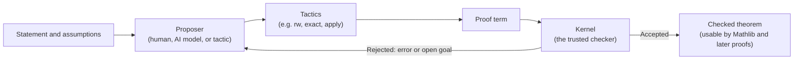

# Lean 4 and Mathlib

_Lean 4 is the programming language and interactive proof checker used at this hack, and Mathlib is its community library of already checked mathematics that a Lean project builds on._

## ELI5

Think of ordinary math writing as a recipe that assumes the cook already knows dozens of kitchen basics and will fill in gaps. A formal Lean proof is the same recipe rewritten so explicitly that a very literal assistant, one who assumes nothing, can follow it and confirm no step was skipped. Lean's kernel is that assistant: a program that checks a candidate proof (a proof term) against a precise claim (a theorem). Mathlib is a shared pantry of ingredients other cooks already prepared and checked, so a new proof rarely has to start from raw flour and eggs. A missing ingredient in that pantry is a chance to contribute one.

## What it is, precisely

Formalized mathematics means "a precise mathematical statement and a proof that a computer can check" (deck2.txt, slide 2). Lean is open source software, a programming language and interactive proof assistant based on dependent type theory (deck2.txt, slide 3; https://lean-lang.org/theorem_proving_in_lean4/Introduction/). Three roles recur in every proof: a proposer (a person, an AI model, or a tactic) suggests the next step; Lean's tactics turn that step into a formal object called a proof term; and the kernel, Lean's small trusted core, checks that the term establishes the stated theorem (deck2.txt, slide 3; https://lean-lang.org/doc/reference/latest/The-Type-System/).

The talk's own worked example, in ordinary language: "Let a, b and c be natural numbers. Suppose a equals b and b equals c. We want to show that a equals c" (deck2.txt, slide 4). In Lean:

```lean
theorem equality_chain (a b c : Nat)
    (hab : a = b) (hbc : b = c) : a = c := by
  rw [hab]
  exact hbc
```

Before any step the goal reads `⊢ a = c` alongside `hab : a = b` and `hbc : b = c`; after `rw [hab]` it becomes `⊢ b = c`, which `exact hbc` closes directly (deck2.txt, slide 6). The turnstile marks the current obligation, and reading it, rather than guessing whether the whole argument "sounds right," is how you localize what is actually missing (deck2.txt, slide 6).

## Where it sits in the OpenMath loop

A finite Lean proof can still cover infinitely many cases: the letters in `equality_chain` are arbitrary, so the argument applies to every satisfying triple of natural numbers without Lean enumerating them (deck2.txt, slide 7). That differs from checking a pattern on examples: $f(n) = n^2 + n + 41$ is prime for every $n$ from 0 through 39, but $f(40) = 1681 = 41^2$ is composite, so forty successful tests never amounted to a general proof (deck2.txt, slide 7). Whether a hill needs a general theorem or accepts a scoped, finite result is a property of the registered statement, not of how many cases happened to be checked (deck2.txt, slide 7; handbook.txt, section 3.1).

A checked proof still relies on things outside the kernel's own check: "the definitions and assumptions must express the intended claim," a "declared system and permitted axioms," and the checking environment itself, meaning the kernel, dependencies, and any extra trusted computation (deck2.txt, slide 9). Lean's `#print axioms` command surfaces exactly what a theorem depends on, including any leftover `sorry` (deck2.txt, slide 9). Two failure modes sit on top of a clean compile: proving the wrong statement ("every real x has x² > 0" is false at x = 0, so quietly weakening it to `x² ≥ 0` changes the claim), and leaving a gap behind `sorry`, which Lean permits during development with a warning but which is not a finished proof (deck2.txt, slide 8).

Mathlib is what makes new work cheap to build: "shared definitions, established theorems and proof automation" that a project can build on directly, illustrated by the 2022 Liquid Tensor Experiment formalizing a challenge posed by Peter Scholze (deck2.txt, slide 5). Its own overview page organizes coverage by area, from general algebra and linear algebra through topology, analysis, probability theory, geometry, combinatorics, dynamics, and logic and computation (mathlib-overview.txt). Coverage is uneven by design, not accident: "library coverage varies. Missing prerequisite lemmas can be useful contributions" (deck2.txt, slide 5), which the handbook scores separately under M2, "new, faithful, useful, reusable formalizations of known mathematics" (handbook.txt, section 1).

## Getting started in 15 minutes

For hands-on setup, compiling, and wiring an AI agent to the Lean toolchain, see [Lean with AI agents: the hack playbook](lean-with-ai-agents.md), the practical companion to this page. To learn Lean itself: the Natural Number Game is a gamified, browser-based introduction to Lean 4 proof for beginners (lean-learn.txt; https://adam.math.hhu.de/#/g/leanprover-community/NNG4); Mathematics in Lean teaches formalization through interactive, tactic-based proof using Mathlib, aimed at mathematicians (lean-learn.txt; https://leanprover-community.github.io/mathematics_in_lean/); and Theorem Proving in Lean covers dependent type theory and automated proof methods in more depth (lean-learn.txt; https://lean-lang.org/theorem_proving_in_lean4/).

## Gotchas

- **A passing compile is not the same claim as a true theorem.** Statement fidelity (proving `x² ≥ 0` when the intended claim was `x² > 0`) and proof completeness (`sorry`) are two separate, easy-to-miss failure modes (deck2.txt, slide 8).
- **"Looks impressive" is not "general."** Forty successive prime values of $n^2 + n + 41$ never proved a universal claim; only what the theorem statement actually quantifies over does (deck2.txt, slide 7).
- **Trust is made explicit, not eliminated.** A checked proof depends on its definitions expressing the intended mathematics, its declared axioms, and a correctly functioning checking environment; `#print axioms` is how you inspect that, including any leftover `sorry` (deck2.txt, slide 9).
- **A missing lemma is an opportunity, not a dead end.** Mathlib's coverage is acknowledged to vary, and filling a genuine gap is itself a recognized, scoreable contribution under the competition's M2 category (deck2.txt, slide 5; handbook.txt, section 1).

## Diagram



## Sources

- deck2.txt (OpenMath 2026 talk transcript and slides, Alejandro Zarzuelo Urdiales)
- lean-learn.txt (lean-lang.org Learn page content)
- mathlib-overview.txt (leanprover-community.github.io Mathlib overview)
- handbook.txt (Open Problems Hack at MIT, Competition and Judging Handbook, September 2026)
- https://lean-lang.org/theorem_proving_in_lean4/Introduction/
- https://lean-lang.org/doc/reference/latest/The-Type-System/
- https://adam.math.hhu.de/#/g/leanprover-community/NNG4
- https://leanprover-community.github.io/mathematics_in_lean/
- https://lean-lang.org/theorem_proving_in_lean4/
</content>
