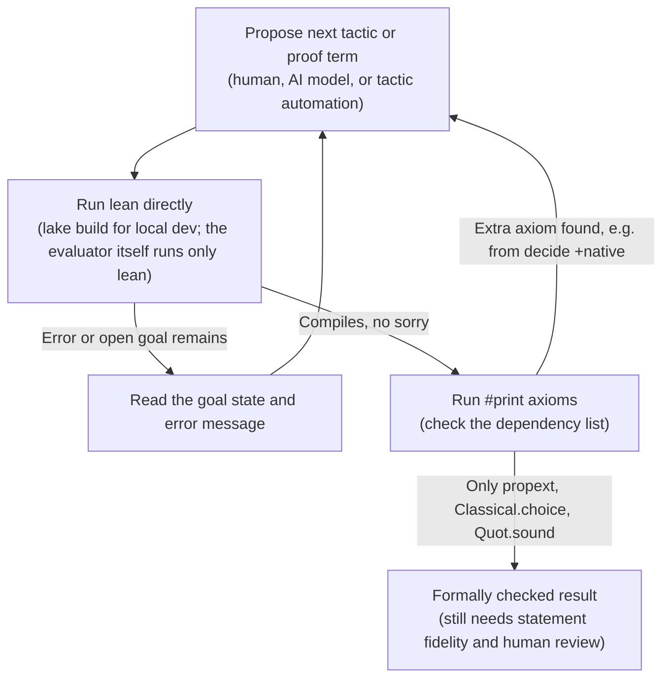

# Lean with AI agents: the hack playbook

_A practical, step by step guide to using Lean 4 as the machine checker in an AI plus formal verification loop, tuned for OpenMath 2026 (Sundai Hack 142)._

## ELI5

Imagine handing a math argument to an editor who refuses to accept "trust me" anywhere and will only sign off once every single step visibly follows from the one before it. Lean is that editor: a computer program that reads a precise mathematical claim and a candidate argument, and either accepts the argument as airtight or points at the exact line where it breaks. An AI model, or a person, proposes the next step, and Lean's own compiler checks it: not instantly, since a real check against a large library like Mathlib is documented to usually take one to two minutes, and the checker is allowed to run for much longer than that before giving up ("the run log shows what is happening during the ~1-2 min compile instead of sitting blank," erdos-3.eval.py; internal timeout `LEAN_TIMEOUT_S = 1500` in erdos-3.eval.py; outer `watchdog_timeout_s: 1800` in erdos-3.hill.yaml). The loop repeats until the argument closes cleanly. Because the editor is a program and not a person, it never gets tired, never assumes a step is "probably fine," and never accepts a hand wave. This is genuinely how it works. It is just a slower, stricter version of an ordinary compiler check, run over and over in a loop with a human or an AI in the driver's seat.

## What it is, precisely

Lean is open source software: a programming language and an interactive proof assistant built on dependent type theory (deck2.txt, slide 3; https://lean-lang.org/theorem_proving_in_lean4/Introduction/, https://lean-lang.org/doc/reference/latest/The-Type-System/). You write definitions and theorem statements, and Lean shows the goals left to prove. A person, an AI model, or an automated tactic can propose the next step; Lean turns those steps into a formal object called a proof term, and its kernel, the small trusted checking core, verifies that the term actually establishes the stated theorem (deck2.txt, slide 3). Mathlib is the community's shared library of definitions, theorems, and proof automation a project can build on instead of re-deriving elementary mathematics from scratch (deck2.txt, slide 5; https://leanprover-community.github.io/mathlib-overview.html).

For this hack, "Lean plus AI agents" means putting an AI coding agent (for example Claude Code) in the proposer role of that same loop: the agent edits a `.lean` file, runs the Lean toolchain from the shell exactly the way a person would, reads the compiler's goal state and error output, and edits again. This iterative edit, compile, read, edit cycle is the climber's own private development process, not the evaluator's grading mechanism: as the erdos-3 example below shows, the evaluator itself runs a single, one-shot check of the finished proof rather than an iterative loop. What the two share is the underlying tool, the `lean` binary itself, so practicing the loop locally is still a fair rehearsal of the exact check a submission will face.

## Where it sits in the OpenMath loop

The Competition and Judging Handbook is explicit that only formalized results score: "Only formalized results count. Every accepted claim must pass a pinned, approved formal checker and mathematical review of its exact statement, novelty, scope, and attribution. Informal proofs, numerical patterns, and model confidence do not score" (handbook.txt, section 1). Lean is one route to that pinned, approved formal checker. What Lean's kernel establishes on its own is narrow: that a specific proof term inhabits a specific stated type, given a declared set of axioms. It cannot establish whether that type is the mathematics anyone cares about or whether it is novel: "a checker validates a formal statement under its declared assumptions; reviewers must still establish that it faithfully represents the claimed mathematics" (handbook.txt, section 1), and, on any checker generally, "even an evaluator using exact arithmetic is not automatically a Lean proof of its own correctness" (deck2.txt, slide 10).

The erdos-3 hill shows exactly how a Lean checker plugs into this loop. Its fixed statement (erdos-3.statement.lean) is:

```lean
theorem hill : answer(sorry) ↔ ∀ A : Set ℕ,
    (¬ Summable fun a : A ↦ 1 / (a : ℝ)) →
    ∃ᶠ (k : ℕ) in Filter.atTop, ∃ S ⊆ A, S.IsAPOfLength k :=
```

A climber submits only `solution.lean`, the proof following the `:=` (erdos-3.README.md). The evaluator (erdos-3.eval.py) concatenates the fixed statement, the submitted proof, and a trailing `#print axioms hill`, writes that to a temporary file, points `LEAN_PATH` at the formal-conjectures project's built Mathlib libraries, and runs `lean` on it as a subprocess with a 1500 second internal timeout (`LEAN_TIMEOUT_S = 1500`), streaming Lean's own output as it arrives. It fails the attempt if the output contains `sorryAx` or the string "declaration uses 'sorry'", fails if the process exits nonzero, and otherwise parses the axiom list Lean printed; if that list contains anything outside `{"propext", "Classical.choice", "Quot.sound"}` it fails too. Only then does it report `passed: True` with metric `proved = 1.0`. The hill's manifest (erdos-3.hill.yaml) pins the checking image to `ghcr.io/ottogin/lean-mathlib@sha256:964547ad81e109c78545512867bae70b710c55d833078674878faad7de0ebb85` and sets an outer watchdog of `watchdog_timeout_s: 1800`; the toolchain version, `v4.33.1`, is reported separately by the evaluator's own config function rather than by the manifest (erdos-3.eval.py, `_config()`).

A different hill, `clique-cluster-ramsey-multiplicity`, makes an instructive contrast: its checker is a Python script doing exact rational arithmetic on a JSON certificate, not a Lean kernel, and its own README says so directly: "The Python checker and mathematical lifting argument are the computational trust boundary. Passing is not a claim of Lean/Coq verification or competition admission" (clique-cluster-ramsey-multiplicity.README.md, line 90). A team that finds or improves a construction there could additionally formalize the specific finite witness as a Lean theorem, a separate artifact that raises the trust boundary from "a Python script says so" to "Lean's kernel says so." The natural tactics for that finite check are `decide` (checked by the kernel itself, including the explicit kernel-reduction spelling `decide +kernel`) and native evaluation (`decide +native`, formerly written `native_decide`), which compiles the check to native code for speed instead of reducing it in the kernel. They are not interchangeable for scoring: the Lean reference manual states that `decide +native` admits its result via an axiom, `Lean.trustCompiler` through Lean 4.28.0 and one dedicated axiom per computation from 4.29.0 onward (https://lean-lang.org/doc/reference/latest/ValidatingProofs/), and Lean's own axioms reference separately states that "the `native_decide` tactic creates a bespoke axiom for each invocation" (https://lean-lang.org/doc/reference/latest/Axioms/); either way, a `decide +native` (`native_decide`) proof will show an axiom outside Lean and Mathlib's standard three the moment you run `#print axioms`, exactly what erdos-3's evaluator (and any hill checked the same way) rejects. Plain `decide` and `decide +kernel` stay inside the standard three axioms if they finish in time; native evaluation is faster but spends a different, non-default trust assumption to get there.

## Getting started in 15 minutes

1. **Read a tiny proof in the browser.** Open https://live.lean-lang.org/ and try the equality example from the talk: for natural numbers with `hab : a = b` and `hbc : b = c`, `theorem equality_chain (a b c : Nat) (hab : a = b) (hbc : b = c) : a = c := by rw [hab]; exact hbc` closes the goal `a = c` (deck2.txt, slides 4 and 6). Delete `exact hbc` and watch the goal reopen to `⊢ b = c`, then restore it (deck2.txt, slide 12). That is the whole feedback loop in miniature.
2. **Set up a local project.** Install the toolchain manager elan with `curl https://elan.lean-lang.org/elan-init.sh -sSf | sh` (https://lean-lang.org/install/manual/), scaffold a project with Mathlib already wired in using `lake +leanprover-community/mathlib4:lean-toolchain new MyMathlibProject math`, and build it with `cd MyMathlibProject && lake build` (https://lean-lang.org/install/manual/). Install the official VS Code extension with `code --install-extension leanprover.lean4` (https://lean-lang.org/install/manual/).
3. **Wire an agent to a similar loop.** Have Claude Code, or any shell-capable agent, edit `solution.lean`, then run `lean` directly on the file, exactly as erdos-3.eval.py does: the evaluator invokes only `subprocess.Popen(["lean", str(check_file)], ...)`, never `lake build`, feeding the compiler's stdout, in particular the remaining goal state and any error line, back to the model as the next prompt. During local development inside a full Mathlib-linked project, `lake build` is the normal way to compile day to day, but remember the evaluator itself checks one concatenated file with plain `lean`, run once against the finished submission rather than in a loop. Dedicated Lean LSP or MCP integrations exist for a tighter, incremental loop than shelling out to a full recompile each time; no official repo page for a specific one was fetched for this page, so treat that option as an open item to verify with the organizers or the Lean community before depending on it.
4. **Search Mathlib before writing a lemma from scratch.** The `apply?` tactic "tries to find the relevant theorem in the library" (https://leanprover-community.github.io/mathematics_in_lean/C02_Basics.html); its sibling `exact?` looks for a library lemma that closes the current goal outright. Loogle (https://loogle.lean-lang.org/) matches by constant name, by name substring in quotes, by subexpression pattern such as `_ * (_ ^ _)`, or by conclusion shape such as `|- tsum _ = _ * tsum _`, and combines multiple filters with commas. LeanSearch and LeanExplore offer natural language search over Mathlib declarations instead (lean-learn.txt).
5. **Know the broader AI-for-Lean ecosystem, cautiously.** LeanDojo is described as "a tool for data extraction and interacting with Lean programmatically" (lean-learn.txt). Lean Copilot's own README states it "allows large language models (LLMs) to be used natively in Lean for proof automation, e.g., suggesting tactics/premises and searching for proofs" (github.com/lean-dojo/LeanCopilot, fetched 2026-09-27). DeepSeek-Prover-V2 describes itself as "an open-source large language model designed for formal theorem proving in Lean 4, with initialization data collected through a recursive theorem proving pipeline powered by DeepSeek-V3" (github.com/deepseek-ai/DeepSeek-Prover-V2, fetched 2026-09-27). Kimina-Prover, Goedel-Prover, and Harmonic Aristotle are not listed here because no official page or paper for them was fetched during this pass; verify each directly before relying on any specific claim about them.

## What we tested on a MacBook

The two results below were tested locally by the author during this pass, on a MacBook, and are not part of any organizer-published benchmark; verify independently before relying on the timings for a submission strategy, since they depend on this machine's specific Lean build rather than on the pinned competition image.

- **Laderman's Brent identities, in core Lean, with no Mathlib.** Using core Lean 4.34.1 with no Mathlib loaded, all 729 Brent identities for Laderman's rank-23 decomposition of the 3x3 matrix-multiplication tensor (the decomposition and identity count described in matrix-multiplication-tensor-3x3.README.md: "The evaluator expands every candidate exactly and checks all 729 Brent identities") were proved with the tactic `decide +kernel` in about 3 seconds of compile time. `#print axioms` on the result listed only `propext`.
- **An exact Grothendieck-constant witness, also in core Lean.** For the grothendieck-constant-witnesses hill, an exact 2x2 witness with unit vectors `u = (-195,-28)/197, (28,-195)/197` and `v = (-3,-4)/5, (-4,3)/5` scored `gap_ppm` 1414213 with 80 certificate bits under the hill's own evaluator functions (grothendieck-constant-witnesses.eval.py computes exactly these two metrics: `{"name": "gap_ppm", ...}` from the objective-to-sign-optimum ratio, and `{"name": "certificate_bits", ...}` via `_certificate_bits`). The corresponding Lean statement for this witness was proved in core Lean in about 1.7 seconds, again using only the `propext` axiom.

Three practical lessons came out of getting those two checks to run cleanly:

- **elan's installer may need `--no-modify-path` in a sandboxed shell.** In a sandboxed shell, elan's install script can fail when it tries to modify shell startup files to add itself to `PATH`; passing `--no-modify-path` to the installer avoids that failure. The practical consequence is that `lean` is not necessarily on `PATH` afterward, so a script or agent should call it directly at `~/.elan/bin/lean` rather than assume the shell has picked it up.
- **A Lean doc comment containing `/-` opens a nested comment.** Writing the two characters slash then dash inside a comment, for example while describing Lean's own comment syntax in prose, starts a nested block comment rather than being read as plain text, which can silently swallow the rest of the file until a matching `-/` is found. Watch for this whenever a comment needs to mention Lean's comment delimiters.
- **A nonzero exit code is not the only failure signal; `sorryAx` in the output is too.** Even when Lean errors out, it can still print a `#print axioms` line containing `sorryAx`. A pipeline that only checks the process exit code can miss this, so it should treat either a nonzero exit code or the string `sorryAx` anywhere in the output as failure, the same pattern erdos-3.eval.py already uses ("if `sorryAx` in output or `declaration uses 'sorry'` in output: return `_fail(...)`").

## Gotchas

- **`sorry` is a hard fail, not a soft warning, for the checker.** erdos-3.eval.py scans for `sorryAx` and the string "declaration uses 'sorry'" and fails on either (erdos-3.eval.py). The talk's own `theorem gap : 1 = 2 := by sorry` compiles with a warning precisely because `sorry` is permitted during development, not because it proves anything (deck2.txt, slide 8).
- **The fixed statement already contains a placeholder you cannot touch.** erdos-3's frozen theorem type is `answer(sorry) ↔ (...)`. The formal-conjectures project's own contribution guide states the convention: "if the problem has been solved, `answer(sorry)` should be replaced by `answer(True)` or `answer(False)`" (google-deepmind/formal-conjectures CONTRIBUTING.md, fetched 2026-09-27). Climbers submit only the proof after `:=` and are told not to restate the theorem (erdos-3.README.md), so this placeholder is part of the fixed statement. No source fetched for this page explains exactly how a submitted proof is meant to resolve against a `sorry` still embedded in its own goal's type; verify the intended mechanics with the organizers or the formal-conjectures maintainers before betting hack time on this hill.
- **Statement fidelity, not just compilation, decides credit.** The handbook requires "the exact canonical target" with "no mathematical gap" and passing checks before anything counts as a verified solution rather than a candidate (handbook.txt, section 9.1). The talk's illustration: "every real x has x² > 0" is false at x = 0, so silently weakening `>` to `≥` proves a different claim (deck2.txt, slide 8).
- **Extra axioms are a silent failure mode.** Beyond the `decide +native` (`native_decide`) trap above, any dependency Lean reports outside `{"propext", "Classical.choice", "Quot.sound"}` fails erdos-3's check (erdos-3.eval.py); run `#print axioms` on your own theorem before submitting, not after.
- **Version pinning is enforced, not optional.** erdos-3.hill.yaml pins a specific `environment.image` by full sha256 digest, and erdos-3.eval.py separately reports `toolchain: v4.33.1` in its own config output; the handbook separately requires "pinned prover/library versions" and "reproducible build instructions" for every score-bearing artifact (handbook.txt, section 7.1).
- **The checker has a clock.** erdos-3.eval.py kills Lean if it "did not finish within 1500s"; the hill's own outer watchdog is `watchdog_timeout_s: 1800` (erdos-3.hill.yaml). A proof that only compiles given unlimited time is not a passing proof here.

## Diagram



## Sources

- deck2.txt (OpenMath 2026 talk transcript and slides, Alejandro Zarzuelo Urdiales)
- lean-learn.txt (lean-lang.org Learn page content)
- handbook.txt (Open Problems Hack at MIT, Competition and Judging Handbook, September 2026)
- hills/erdos-3.statement.lean
- hills/erdos-3.eval.py
- hills/erdos-3.README.md
- hills/erdos-3.hill.yaml
- hills/clique-cluster-ramsey-multiplicity.README.md (line 90)
- hills/matrix-multiplication-tensor-3x3.README.md
- hills/grothendieck-constant-witnesses.eval.py
- https://lean-lang.org/theorem_proving_in_lean4/Introduction/
- https://lean-lang.org/doc/reference/latest/The-Type-System/
- https://lean-lang.org/doc/reference/latest/Axioms/
- https://lean-lang.org/doc/reference/latest/ValidatingProofs/
- https://leanprover-community.github.io/mathlib-overview.html
- https://lean-lang.org/install/manual/
- https://live.lean-lang.org/
- https://leanprover-community.github.io/mathematics_in_lean/C02_Basics.html
- https://loogle.lean-lang.org/
- https://github.com/lean-dojo/LeanCopilot (fetched 2026-09-27)
- https://github.com/deepseek-ai/DeepSeek-Prover-V2 (fetched 2026-09-27)
- https://github.com/google-deepmind/formal-conjectures/blob/main/CONTRIBUTING.md (fetched 2026-09-27)
- https://github.com/google-deepmind/formal-conjectures/blob/main/README.md (fetched 2026-09-27)
