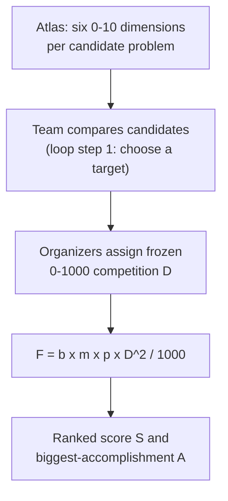

# Ulam OPDP Difficulty Atlas
_A public, versioned scoring profile that rates open math problems on several difficulty dimensions instead of one prestige number, so a team can pick a target that actually fits a week._

## ELI5
Imagine a boss-fight stat screen in a game, but instead of one "difficulty" star rating it shows separate bars for how conceptually hard the fight is, how much your specific toolkit helps against it, how likely you are to land a real hit in a fixed amount of time, and how much extra work it takes to prove you actually won. The Ulam OPDP Atlas does that for open math problems: it splits "how hard is this" into named dimensions so a team can see that a problem is conceptually brutal but AI-friendly, or the reverse. It never plays the fight for you, and a favorable score is a curated estimate, not a guarantee you will land the hit this week.

## What it is, precisely
The Atlas is authored by Alejandro Zarzuelo Urdiales, credited with ChatGPT 5.6 Sol, and describes itself as "an auditable Open Problem Difficulty Profile (OPDP) for 102,819 records" (atlas/README.md). The README explains the point of the profile separately: "The atlas replaces a single, ambiguous notion of \"difficulty\" with a granular profile covering intrinsic mathematical difficulty, AI-relative difficulty, human attention, tractability, verification burden, formalization burden, prerequisite depth, breadth, and tool leverage" (atlas/README.md). It ships in versions: v1.6 is a frozen, statement-bearing compatibility set of 15,458 records; v1.7 appends 87,105 excerpt-based MathDB public-catalog items for 102,563 records total; v1.8 further appends 256 curator-authored ProofAtlas intake records for 102,819 records total. The README states the append cohorts "are explicitly provisional and capped at C0 confidence," a lower trust tier than the frozen v1.6 records.

Each atlas record scores a problem on the named sub-dimensions on a 0 to 10 scale, visible in the local match file for this hack: intrinsic_difficulty (a range, a confidence code, and a tier such as T3 Serious Project or T4 Frontier Challenge), ai_assessment (a relative adjustment and a fit label such as ai_favored or ai_neutral_mixed), tractability (a progress-probability band and a fixed target_combined_hours of 100), verification (separate scores for if the claim is true versus if it is false, since a positive proof and a negative refutation can cost very different amounts to check), formalization (the burden to encode the statement and prerequisites, explicitly not the burden of an unknown proof), and tool_leverage (higher is more favorable). Each record also names a recommended_approach, for example status_and_literature_audit or expert_guided_proof_search.

## Where it sits in the OpenMath loop
The Atlas belongs entirely before the loop starts. The organizers' description of the recursive loop opens with "Choose or propose a target. Start with the versioned competition corpus or nominate an eligible problem or variation" (rsihouse.txt); the Atlas is the tool for that first step. It establishes nothing about correctness on its own, and its 0 to 10 sub-scores are not the competition's own difficulty number. The handbook is direct: contestants must use the published OPDP difficulty score supplied to contestants on the 0 to 1000 scale directly as D(P), without rescaling or substituting another Atlas dimension (handbook, section 3.3). New targets not yet scored get three independent assessments under the same methodology, and the median is used; a spread over 150 points forces discussion and a documented consensus.

That 0 to 1000 D feeds the competition score directly: F(T,P) equals b(T,P) times m(P) times p(T,P) times D(P) squared divided by 1000, where b is 1.1 for the frozen focus set and 1 otherwise, m is 1 for M1/M3A and 0.5 for M3B, and p is the reviewed progress coefficient between 0 and 1 (handbook, section 4.1). Because only D is squared, the handbook's worked table shows base points of 160, 360, 640, 810, and 1000 for D of 400, 600, 800, 900, and 1000. Two complete D of 600 results (p=1) give a total score of 720 but a biggest-accomplishment score of only 360, while one complete D of 800 result gives both totals as 640; a D of 800 result accepted at p=0.5 earns 320 points, and improving that same family to p=1 lands at 640, not 960, because progress and multipliers stay linear while only difficulty is squared (handbook, section 4.2).

## Getting started in 15 minutes
Read the first 60 lines of atlas/README.md for the file map, then look at the locally supplied atlas_hill_matches_v1.6.json, which pairs several hills with candidate atlas records. For Erdos Problem #3, the matched record (EP-3) scores intrinsic difficulty 6.1 (range 4.9 to 7.3, confidence C2), an AI-adjusted difficulty of 5.6 (ai_neutral_mixed), a tractability band of 25 to 40 percent over 100 combined hours, and recommends Expert-guided proof search. For the general Kobon triangle problem, the matched record (AMR-071-0050, sourced from a pinned Wikipedia revision and flagged NEEDS_REVIEW) scores intrinsic difficulty 5.4, AI-adjusted 4.9, and recommends Status and literature audit; this is a useful comparison but not a substitute for reading the hill's own fixed n=18 task. For the full corpus, the recommended website-import payload is Ulam_MathDB_ProofAtlas_OPDP_Assessments_v1.8.json.gz, distributed over Git LFS (atlas/README.md).

## Gotchas
- Never convert a 0 to 10 Atlas sub-score into the competition's 0 to 1000 D; the handbook forbids it outright (section 3.3).
- The MathDB and ProofAtlas append cohorts (v1.7, v1.8) are capped at C0 confidence and explicitly provisional; the frozen 15,458-record v1.6 set carries the older, better-audited assessments.
- Tractability forecasts "independently checked partial progress in 100 combined expert-plus-AI hours, not full resolution" (atlas/README.md); its progress-probability bands describe partial-progress estimates over that fixed 100-hour target, not solve-probability odds on completing the whole problem.
- Catalog status can be stale: the research catalog's own entry 1, the Babai graph-isomorphism conjecture, is flagged "resolved as stated" in hills/_list_readme.md ("Babai proved quasipolynomial-time graph isomorphism"), a reminder that status review lags the literature even though that specific catalog is a separate document from this Atlas page's own README/handbook/deck anchors.
- An atlas record matched to a hill may describe the general historical problem rather than the hill's own narrower, fixed-parameter task; the Kobon match above is exactly that case.

## Diagram

## Sources
- https://github.com/alejandrozu/ulam-opdp-difficulty-atlas
- OpenMath Competition and Judging Handbook, https://rsihouse.ai/openmath/handbook.pdf
- talk "Mathematics beyond the human mind" (Alejandro Zarzuelo Urdiales, OpenMath 2026)
- Sundai Hack 142 deck, https://www.sundai.club/guide
- Ulam OPDP Atlas v1.6 dataset, https://github.com/alejandrozu/ulam-opdp-difficulty-atlas
- https://app.autolab.ai/lists/alejandrozu/openmath
