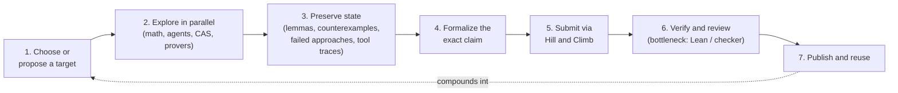

# The Recursive Improvement Loop
_The hoped-for cycle where a week's mathematical work produces better research tools that make the next attempt more effective, tested rather than assumed at OpenMath._

## ELI5
Think of a locksmith who does not just move on after picking one lock: they look at what worked, file a slightly better pick from it, and carry that better pick into the next lock. Recursive self-improvement (RSI) in this hack is the same idea applied to math research: today's lemma, counterexample, or verified technique becomes tomorrow's tool, and if the pattern holds across many attempts, the whole research process gets faster over time. The honest part of the story, and the part the organizers stress, is that the locksmith's new pick might only work on one odd lock and jam on every other one; whether the improvement actually transfers is something you test, not something you assume.

## What it is, precisely
The organizers ground this idea in two cited systems: FunSearch, which combined a language model with program search and evaluation to discover new cap-set constructions, and AlphaEvolve, which later reported improvements in algorithms including matrix multiplication (deck1, slide 2, paraphrasing speaker Alejandro Zarzuelo Urdiales; the slide cites the FunSearch Nature paper and the AlphaEvolve DeepMind blog post as sources). The slide frames both as evidence within systems where "Human-designed research systems combine generation with evaluation" (deck1, slide 2), showing that AI can contribute inside a research loop, not proof that mathematical judgment or independent checking are no longer needed.

The recursive loop itself is presented as three stages: mathematical work produces methods and algorithms, better research tools make further questions accessible, and a compounding-future-achievements stage tests whether the improvement actually compounds, explicitly labeled "A research hypothesis, with bottlenecks and failure modes" (deck1, slide 23, paraphrased). The speaker's own framing is careful: "AlphaEvolve offers an example of algorithm discovery contributing to computing infrastructure, but that is not a demonstration of unlimited autonomous improvement. Verification, data, compute and problem selection can remain bottlenecks" (deck1, slide 23 notes).

OpenMath operationalizes this as a concrete seven-step loop (rsihouse.txt, "A recursive loop designed to compound"): choose or propose a target; explore in parallel with mathematics, AI agents, search, code, symbolic tools, or theorem provers; preserve useful state, specifically "lemmas, counterexamples, failed approaches, improved statements, proof dependencies, and tool traces that can improve the next attempt"; formalize the exact claim in an approved environment; submit through the official Hill and Climb workflow; verify and review by re-running the checker and confirming statement fidelity, novelty, classification, conflicts, and attribution; and publish and reuse, so accepted work enters the record as reusable public artifacts.

## Where it sits in the OpenMath loop
This tool page describes the whole loop rather than one stage of it, but the hinge is step 6, verification, because everything upstream only compounds if the check at the end is trustworthy. The handbook is explicit that the verifier, not the generator, is the actual gate: "Only formalized results count. Every accepted claim must pass a pinned, approved formal checker and mathematical review of its exact statement, novelty, scope, and attribution" (handbook, section 1). Deck1's own evidence checklist for whether an improvement is real, not just impressive, asks about generality, "success across unfamiliar mathematical fields"; reliability, "independent checking of exact claims"; efficiency, "results relative to compute and human effort"; and reuse, "artifacts that help a later attempt" (deck1, slide 22, paraphrased), and warns that "a larger number of submissions by itself answers none of these questions." Among the available checkers, Lean's kernel works as a separate, narrow proof-term checker rather than a persuasive transcript: "A confident model response has no special authority here. The result depends on the exact statement, the declared dependencies, and the checking environment" (deck2, slide 3). The distinction that matters for scoring is in the handbook: a hill's own evaluator can check a construction exactly, but a score-bearing competition claim additionally needs the approved formal check and human review (handbook, sections 7 and 9), which is where Lean enters the loop.

## Getting started in 15 minutes
There is no separate tool to install for this one; the practical first step is process discipline. Before your first climb, set up a shared, timestamped log (a repo, a notebook, or a plain file in your climb's workspace) and commit to writing down every lemma, counterexample, failed approach, and tool trace as you go, exactly the categories the loop's step 3 asks you to preserve (rsihouse.txt). Read the handbook's disclosure expectations before you start rather than after: "Preserve relevant code, notebooks, seeds, and provenance" (handbook, section 7.1), because your later submission packet needs this same material to satisfy the provenance and artifact sections of the minimum submission packet (handbook, section 8).

## Gotchas
- A maximized hill metric is not the same as real progress; the deeper trap is optimizing the number a hill's evaluator reports without also producing the matching upper bound or general theorem the mathematics actually needs (deck2, slide 10), which is a distinct point from the handbook's separate statement that a passing hill is not itself a mathematical proof (handbook, section 7.2).
- sorry in Lean lets a file build while silently leaving a gap: "sorry is an unfinished proof, permitted during development with a warning... A successful-looking file can still miss the intended mathematical result. Careful with sorries!!" (deck2, slide 8).
- Statement fidelity errors are easy to miss: changing a strict inequality to a non-strict one, or otherwise altering a hidden hypothesis or conclusion, produces a different, often easier claim, and reviewers explicitly check for this: "stronger hidden hypotheses or weaker conclusions cannot masquerade as the original solution" (handbook, section 7.1).
- Do not assume compounding is automatic. The loop is explicitly framed as "a research hypothesis, with bottlenecks and failure modes" (deck1, slide 23), and the organizers' own evidence bar of generality, reliability, efficiency, and reuse is deliberately hard to satisfy in one week.

## Diagram

## Sources
- talk "Mathematics beyond the human mind" (Alejandro Zarzuelo Urdiales, OpenMath 2026)
- https://rsihouse.ai/openmath
- OpenMath Competition and Judging Handbook, https://rsihouse.ai/openmath/handbook.pdf
- talk "Programming in Lean" (Alejandro Zarzuelo Urdiales, OpenMath 2026)
