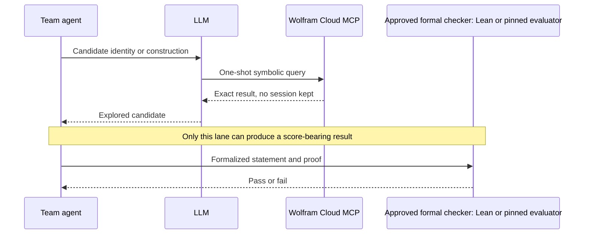

# Wolfram Cloud MCP
_A free, hosted Model Context Protocol server that lets an AI client call Wolfram's symbolic engine and knowledgebase for exact computation, with no persistent session and no proof-checking authority._

## ELI5
Picture your AI assistant keeping a very precise, very literal-minded calculator-and-reference-librarian on speed dial. When the assistant hits a question that needs an exact integral, a checked identity, or a curated fact rather than a guess, it phones this librarian, gets back an exact answer with the working shown, and reports that back to you. The librarian has no memory between calls, though: every call is a fresh, one-shot conversation, and it will not hold a file for you or remember what you asked five minutes ago.

## What it is, precisely
MCP, the Model Context Protocol, is the open standard this hack's tools use to let an LLM call external tools mid-conversation. Wolfram offers two MCP access modes. Wolfram Cloud MCP is the "Remote/Cloud/One-shot stateless" option: "Lightweight deployment, No infrastructure. Get started in seconds," but "Does not support sessions, Only single requests allowed," "Does not support custom servers," and "Does not support external files, Does not support file upload or download" (wolfram-mcp.txt). Wolfram Local MCP is the opposite, a "Local/Self-managed/Session based" option built for "AI coding tools" such as Claude Code or Cursor, offering persistent sessions, custom server deployment, local file access, and notebook support, and it is "Included with Wolfram|One and Mathematica" rather than free-standing.

Cloud MCP's own how-it-works description is a five-step relay: the user or agent sends a query to the LLM, the LLM decides it needs computation or trusted data, the LLM calls the Wolfram tool via MCP, Wolfram returns trusted results, and the LLM presents those results back (wolfram-mcp.txt). The product page frames the value proposition as "Accurate computed results, not hallucinations," "Open-ended custom computation, not document retrieval," and "Curated Wolfram data, not web crawls." Per Wolfram's own support documentation, Wolfram Cloud MCP is free to use and does not require any authentication, and its endpoint is a remote streamable-HTTP server; the vendor page also lists "Free for limited personal use" as the access terms (wolfram-mcp.txt). Separately, the Sundai organizer deck for this hack states under Credits that Wolfram Research provided an MCP link and free credits for the event (sundai-guide.txt); this is the organizers' claim about the hack specifically, distinct from Wolfram's generic product terms, and the two statements should not be assumed to describe the same allotment.

## Where it sits in the OpenMath loop
Wolfram Cloud MCP is an exploration tool, not a checking tool. It belongs in the loop's second step, "Explore in parallel. Use mathematics, AI agents, search, code, symbolic tools, theorem provers, or any lawful combination" (rsihouse.txt), where it is good for exact symbolic computation, checking an identity before committing to it, or numerically probing a candidate construction before spending time formalizing it. It cannot establish a score-bearing result on its own. The competition's own framing is unambiguous: "Only formalized results count... Informal proofs, numerical patterns, and model confidence do not score" (handbook.txt, section 1), and the event site adds that "a model-generated proof sketch, numerical pattern, informal argument, or persuasive manuscript may be valuable research evidence. It is not, by itself, an accepted competition result" (rsihouse.txt). A Wolfram-verified identity is exactly this kind of research evidence: useful for the explore and preserve-state steps, but the formalize and verify-and-review steps still require the approved formal checker, which for this hack means Lean for the one Lean-checked hill and the pinned Python evaluators for the rest.

## Getting started in 15 minutes
The Cloud MCP server itself needs no signup: per Wolfram's support page, it is free to use, requires no authentication, and is reachable as a remote MCP endpoint, and the vendor's own client list names Claude Code among the supported clients (wolfram-mcp.txt). Wolfram's documented one-click flow is for the Claude desktop and web app specifically: open Claude, click Customize, click Connectors, search for Wolfram, and click the plus icon to add it. That fetched support page states it gives no Claude Code CLI-specific instructions, so before the hack, confirm the exact remote-MCP-server registration syntax against Claude Code's own official documentation rather than assuming the desktop steps transfer directly. If a persistent session, custom server, or local file access is needed instead, for example to keep state across a long symbolic exploration, Wolfram Local MCP is the documented alternative, but it requires an installed Wolfram|One or Mathematica license rather than being free-standing.

## Gotchas
- Stateless means stateless: "Does not support sessions, Only single requests allowed" (wolfram-mcp.txt), so Cloud MCP cannot hold a multi-step derivation across calls the way a notebook or Wolfram Local MCP session can.
- No file upload or download: you cannot hand it a candidate certificate or a large dataset to check; every query is a fresh, self-contained request.
- It is not a proof checker for competition credit. A slick or verified-looking Wolfram derivation is research evidence, not a score-bearing artifact; the handbook's Lean and formal-checker requirements are the actual gate.
- The "free credits" claim traces only to the Sundai organizer deck, not to Wolfram's own product page, which states "Free for limited personal use" without describing event-specific credits; treat the two as separate claims.

## Diagram

## Sources
- https://www.wolfram.com/artificial-intelligence/mcp/cloud/
- Sundai Hack 142 deck, https://www.sundai.club/guide
- OpenMath Competition and Judging Handbook, https://rsihouse.ai/openmath/handbook.pdf
- https://rsihouse.ai/openmath
- https://support.wolfram.com/75237
- https://www.wolfram.com/artificial-intelligence/mcp/cloud/
